# **TRAIN DELAYS & WEATHER AWS FINAL PROJECT**

> Bernáth Máté (SLUCRX)
>
> 2025/12/10

## TECHNICAL DETAILS

> GitHub repository: `https://github.com/bernath-mate/AWS-delays-and-weather`
>
> Contributors added to repository: `szabild\@yahoo.com` and `balint.matyus\@gmail.com`
>
> Course: `Large-Scale Data Architectures - 2025/26 Autumn (ADIN012NABB)`
>
> Instructor: `Borbásné-Szabó Ildikó`
>
> Final Project executed in `AWS Learner Lab \[ALLv2EN-US-LTI13-135597\]`
>
> Delay data source: `https://github.com/ferenci-tamas/vonat-keses/blob/main/data/ProcData.rds`
>
> Weather data source: `https://archive-api.open-meteo.com/v1/archive?latitude=48.1,47.5,46.5,47.2,47.4,46.4,47.5,47.4&longitude=20.8,21.5,20.5,18.5,17,18.2,19,19.5&start_date=2025-06-01&end_date=2025-11-23&daily=temperature_2m_mean,precipitation_sum,wind_gusts_10m_max`
>
> Station coordinates source: `https://github.com/ferenci-tamas/vonat-keses/blob/main/data/allomaskoord.rds`

## STAKEHOLDERS & VALUE

### Target Audience:

1.  `MÁV Pályaműködtetési Zrt.` responsible for actual infrastructure management, they would use insights from Data Warehouse to prioritize targeted infrastructure upgrades where impact is greatest
2.  `MÁV Zrt. Haváriaközpont` using the dataset to choose which stations to monitor in case of extreme weather and allocate resources for them, because they are more likely to suffer delays based on historical data in case of extreme weather
3.  `MÁV Zrt` MÁV-csoport central governing company, deciding schedules and approving investments, likely initiating the adoption of the Data Warehouse project

### Business Benefits of the Project:

1.  `Seeing clearly:` identifies problematic regions and stations which experience the most significant delays
2.  `The effect of weather:` correlates delays with weather events, quantifies the relationship between adverse weather conditions and train delays to support data-driven decision-making
3.  `Optimized resource allocation:` allows MÁV to strategically upgrade infrastructure on the most affected lines rather than spreading the limited resources thinly
4.  `Enables trend analysis:` tracks reliability patterns over time to monitor improvements and identify emerging problem zones, making preemptive maintenance possible
5.  `Expandable:` can be appended later on for more sophisticated variable tracking, this is a solid base platform for Data Warehouse implementation

### **KPIs & ANALYSIS**

#### 1. REGIONAL MEDIAN OF DELAYS \>5 MIN

-   Calculated for normal, unusually hot or cold, windy and unusually rainy days separately

-   Pest region is the worst with 8.33 min median delay, but Budapest is the best with only 5.56 min median delay (bit suspicious as Budapest is wholly inside Pest county, but technically possible)

-   Temperature has outstanding negative effect on punctuality in Dél-Alföld (already the second most delayed region on normal days) with +1.87 min added if the temperature is unusually hot or cold.

-   Wind has no outstanding effect on punctuality in any regions, all having \<1 min difference (but there is positive effect here as well).

-   Precipitation has outstanding negative effect on punctuality in Budapest (otherwise least delayed on normal days) with +2.13 min added if the precipitation is unusually high.

-   Interestingly for some regions there is a positive effect for each weather flag, the strongest example is Dél-Alföld for wind, where the effect is -0.8 min difference in the median delay. This highlights the need for further statistical analysis which is outside the scope of this project.

-   Pest region has no days currently in the dataset, where either temperature or wind is flagged as extreme and daily average delay is larger than 5 minutes, this results in nulls for these values.

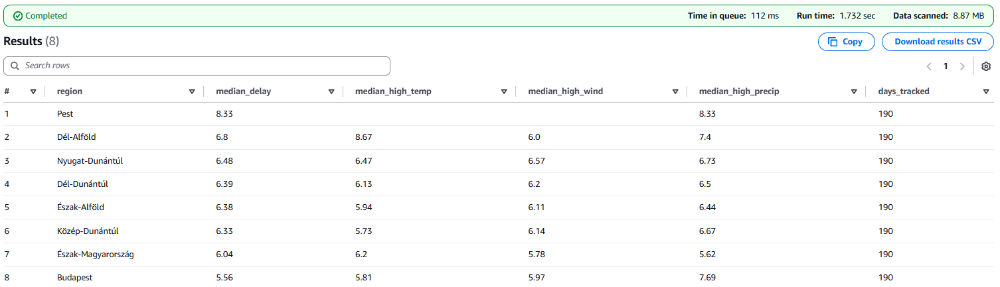

#### 2. DELAY SCORE: PERCENT OF DAYS THAT HAVE \>5 MIN AVERAGE DELAYS

-   Days with \>10 total trains are categorised as delayed if daily average delays is \>5 minutes, the KPI tracks the percentage of these days compared to all days with \>10 trains

-   This is the top 10 chronically delayed stations, all with a 100% (negative) track record, ordered within the presitigous league by the total observed days

-   Generally, Közép-Dunántúl and Nyugat-Dunántúl region is overrepresented with 4-4 stations from the top 10 worst offenders.

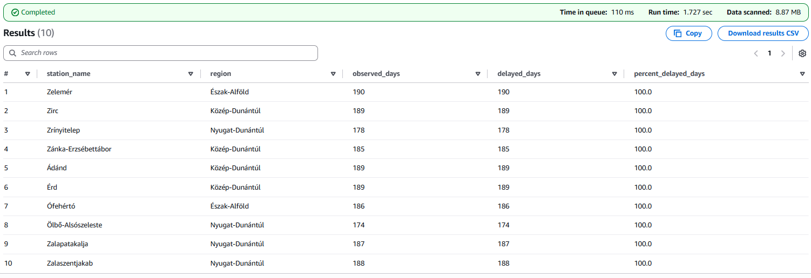

#### 3. RESILIENCE SCORE: PERCENT OF DAYS THAT HAVE MAX. 5 MIN AVERAGE DELAYS ON EXTREME WEATHER

-   Days are categorised as resilient if daily average delays is max. 5 minutes on days with either at least one of the three weather flags being active, the KPI tracks the percentage of these days compared to all extreme weather days
-   This is the bottom 10 stations, all with a 0% track record (when the weather was extreme, average daily delays exceeded 5 min), ordered by the total observed days
-   Generally, we do not see overrepresented regions, these stations are similarly found in all regions

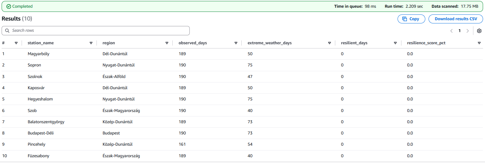

## POSSIBLE FUTURE CONSIDERATIONS

-   Creating adashboard for data visualization (QuickSight is blocked in Learner Lab, would provide native integration of the Athena database created)

-   Tracking other variables as well and applying statistical methods for weather to have more robust findings

-   Refine thresholds for weather (currently extreme if outside -5 and 25 °C mean temperature ; above 45 km/h max wind gust ; above 5 mm daily precipitation)

# **IMPLEMENTATION**

## 0. PIPELINE ARCHITECTURE

### Data Sources:

> MÁV delays CSV (initial load: 2025 June 1 – 2025 November 23; weekly updates thereafter (two completed as testing))
>
> Open-Meteo Weather API (historical + weekly updated daily data from 8 representative regional coordinates)
>
> Station metadata (2647 stations with coordinates, county, and NUTS-2 region mappings)

### Storage Layer (S3 Bucket: delays-weather-slucrx)

> Delay data paths: `raw-data/delays/`
>
> Stations and regions mapping, representative coordinates: `raw-data/config/`
>
> Processed outputs from ETL jobs: `processed-data/delays_all/` and `processed-data/weather_all/` (initial data CSVs also uploaded here)
>
> Query results: `query-results/`

### Data Processing (AWS Glue ETL Jobs)

> `delays-update-weekly-ETL` – filters positive delays (≥0 minutes), aggregates by date and station, joins station metadata, appends to `delays_all` Athena table
>
> `weather-update-weekly-ETL` – fetches weekly weather data from API, applies extreme weather flags (mean temperature outside -5°C to +25°C, wind gusts \>45 km/h, precipitation \>5 mm), stages data and inserts into `weather_all` table
>
> `unified_all-weekly-update-ETL` – refreshes `unified_all` Athena view by joining `delays_all`, `stations_regions`, and `weather_all` tables using date, region and station keys

### Orchestration (AWS Lambda)

> `query-runner-weekly.py` – triggered by CSV uploads to `raw-data/delays/` folder; executes delays and weather ETL jobs in parallel (2-minute timeout), then runs unified_all update sequentially (5-minute timeout)

### Query & Analytics (Amazon Athena)

> Database: `delays_weather`
>
> External tables: `delays_all`, `weather_all`, `stations_regions`
>
> View: `unified_all` (joins `delays_all` and `weather_all` through `stations_regions` as a bridge table for comprehensive analysis)
>
> Output location: `s3://delays-weather-slucrx/query-results/`

### Cost Breakdown of 2.45 USD monthly

> By far AWS Glue and related CloudWatch logging is the most expensive, which is not surpising as this is doing the heavy lifting with the ETL jobs and API calls.
>
> Amazon Simple Storage Service (S3) is negligable because of the small file sizes (despites high dimensions for the tables, textual data is small)
>
> Amazon Athena in current form does not cost much, but if more queries are run or a dashboard is implemented with QuickQight, this would increase (billed based on query numbers)


## 1. PREPROCESS R SCRIPTS

### 1.1 delay_data_preprocessor.R

-   for initial, then used for week 1 (11-24 to 11-30) and week 2 (12-01 to 12-07)
-   could not upload ProcData.rds to GitHub as it is too large (\>25 MB)

``` r
library(dplyr)
library(readr)
library(stringr)
library(jsonlite)

## READ-IN STATION_IDs from LOOKUP JSON
stations_lookup <- fromJSON("stations_ids.json")

# DEFINE MAIN PART AS FUNCTION
process_delay_data <- function(input_file, start_date, end_date, output_file) {
  print(paste("processing:", start_date, "to", end_date))
  
  raw_delay_data <- readRDS(input_file)
  
  # Filter by date range
  raw_delay_data <- raw_delay_data[
    raw_delay_data$Datum >= start_date & 
    raw_delay_data$Datum <= end_date, 
  ]
  
  # Extract station names based on Tipus
  raw_delay_data <- raw_delay_data %>%
    mutate(
      station_name = case_when(
        Tipus == "Szakasz" ~ NA_character_,
        Tipus %in% c("InduloAllomas", "KozbensoAllomas") ~ Indulo,
        Tipus == "ZaroSzakasz" ~ Erkezo,
        TRUE ~ NA_character_
      )
    ) %>%
    filter(!is.na(station_name)) %>%
    filter(station_name != "")
  
  # Rename and clean columns
  raw_delay_data <- raw_delay_data %>%
    rename(date = Datum, delay = Keses) %>%
    select(date, station_name, delay) %>%
    mutate(
      date = as.Date(date),
      station_name = str_trim(str_replace_all(station_name, '"', "")),
      delay = as.numeric(delay)
    )
  
  # FILTER: Keep ONLY positive delays (delay >= 0)
  total_before <- nrow(raw_delay_data)
  raw_delay_data <- raw_delay_data %>%
    filter(delay >= 0)
  total_after <- nrow(raw_delay_data)
  removed <- total_before - total_after
  
  print(paste("Removed", removed, "early arrivals (delay < 0)"))
  print(paste("Kept", total_after, "on-time or delayed records"))
  print(paste("Percentage kept:", round(100 * total_after / total_before, 1), "%"))
  
  # Aggregate by date and station
  delay_aggregated <- raw_delay_data %>%
    group_by(date, station_name) %>%
    summarise(
      total_delay_minutes = sum(delay, na.rm = TRUE),
      train_count = n(),
      avg_delay_minutes = mean(delay, na.rm = TRUE),
      .groups = 'drop'
    ) %>%
    arrange(date, station_name)
  
  # Join with station lookup
  delay_aggregated <- delay_aggregated %>%
    left_join(stations_lookup, by = "station_name") %>%
    select(
      date,
      station_id,
      station_name,
      total_delay_minutes,
      train_count,
      avg_delay_minutes
    ) %>%
    arrange(date, station_name)
  
  write_csv(delay_aggregated, output_file, na = "")
  print(paste("success:", output_file))
  print(paste("Total rows written:", nrow(delay_aggregated)))
}

# RUNS
process_delay_data("ProcData.rds", "2025-06-01", "2025-11-23", "delay_data_initial.csv")
process_delay_data("ProcData.rds", "2025-11-24", "2025-11-30", "delay_data_2025-11-24_2025-11-30.csv")
process_delay_data("ProcData.rds", "2025-12-01", "2025-12-07", "delay_data_2025-12-01_2025-12-07.csv")
```

#### For initial data

```         
[1] "processing: 2025-06-01 to 2025-11-23"
[1] "Removed 1881276 early arrivals (delay < 0)"
[1] "Kept 5281621 on-time or delayed records"
[1] "Percentage kept: 73.7 %"
[1] "success: delay_data_initial.csv"
[1] "Total rows written: 190147"
```

#### For WEEK1 data

```         
[1] "processing: 2025-11-24 to 2025-11-30"
[1] "Removed 74583 early arrivals (delay < 0)"
[1] "Kept 204762 on-time or delayed records"
[1] "Percentage kept: 73.3 %"
[1] "success: delay_data_2025-11-24_2025-11-30.csv"
[1] "Total rows written: 7590"
```

#### For WEEK2 data

```         
[1] "processing: 2025-12-01 to 2025-12-07"
[1] "Removed 73138 early arrivals (delay < 0)"
[1] "Kept 207556 on-time or delayed records"
[1] "Percentage kept: 73.9 %"
[1] "success: delay_data_2025-12-01_2025-12-07.csv"
[1] "Total rows written: 7580"
```

### 1.2 station_regions_preprocessor.R

``` r
## LIBRARY & READ RDS DATA ---------------------------------------------------
library(jsonlite)
stations_df <- readRDS("allomaskoord.rds")

# RENAME AND SELECT COLUMNS
names(stations_df)[names(stations_df) == "Allomas"] <- "station_name"
head(stations_df)

# DEFINE COUNTY BOUNDING BOXES (LAT/LON RANGES) ------------------------------
COUNTY_BOUNDS <- list(
    "Budapest" = list(lat_min = 47.37, lat_max = 47.63, lon_min = 18.92, lon_max = 19.28),
  "Borsod-Abaúj-Zemplén" = list(lat_min = 47.8, lat_max = 48.7, lon_min = 20.2, lon_max = 21.5),
  "Heves" = list(lat_min = 47.3, lat_max = 48.2, lon_min = 19.7, lon_max = 20.8),
  "Nógrád" = list(lat_min = 47.7, lat_max = 48.7, lon_min = 18.8, lon_max = 20.2),
  "Hajdú-Bihar" = list(lat_min = 46.9, lat_max = 47.8, lon_min = 20.6, lon_max = 22.2),
  "Jász-Nagykun-Szolnok" = list(lat_min = 46.7, lat_max = 47.5, lon_min = 19.8, lon_max = 21.0),
  "Szabolcs-Szatmár-Bereg" = list(lat_min = 47.5, lat_max = 48.6, lon_min = 21.1, lon_max = 22.9),
  "Bács-Kiskun" = list(lat_min = 45.8, lat_max = 47.0, lon_min = 18.6, lon_max = 20.3),
  "Békés" = list(lat_min = 46.1, lat_max = 47.2, lon_min = 20.5, lon_max = 21.9),
  "Csongrád-Csanád" = list(lat_min = 46.1, lat_max = 47.0, lon_min = 19.8, lon_max = 20.9),
  "Fejér" = list(lat_min = 46.8, lat_max = 47.4, lon_min = 18.0, lon_max = 19.3),
  "Komárom-Esztergom" = list(lat_min = 47.3, lat_max = 47.9, lon_min = 17.5, lon_max = 18.9),
  "Veszprém" = list(lat_min = 46.6, lat_max = 47.8, lon_min = 17.0, lon_max = 18.6),
  "Győr-Moson-Sopron" = list(lat_min = 47.2, lat_max = 48.1, lon_min = 16.3, lon_max = 18.0),
  "Vas" = list(lat_min = 46.7, lat_max = 47.8, lon_min = 15.9, lon_max = 17.3),
  "Zala" = list(lat_min = 45.8, lat_max = 47.2, lon_min = 15.9, lon_max = 17.4),
  "Baranya" = list(lat_min = 45.8, lat_max = 46.6, lon_min = 17.2, lon_max = 18.9),
  "Somogy" = list(lat_min = 45.8, lat_max = 47.0, lon_min = 17.0, lon_max = 18.5),
  "Tolna" = list(lat_min = 46.2, lat_max = 46.9, lon_min = 18.2, lon_max = 19.4),
  "Pest" = list(lat_min = 47.0, lat_max = 48.0, lon_min = 18.6, lon_max = 20.2)
)

# DEFINE ASSIGNMENT FUNCTIONS ------------------------------------------------
# assign county based on lat/lon bounds
assign_county <- function(lat, lon) {
  for (county_name in names(COUNTY_BOUNDS)) {
    bounds <- COUNTY_BOUNDS[[county_name]]
    
    if (lat >= bounds$lat_min & lat <= bounds$lat_max &
        lon >= bounds$lon_min & lon <= bounds$lon_max) {
      return(county_name)
    }
  }
  return(NA)
}

# assign NUTS-2 region based on county
assign_region <- function(county) {
  region_map <- list(
    "Borsod-Abaúj-Zemplén" = "Észak-Magyarország",
    "Heves" = "Észak-Magyarország",
    "Nógrád" = "Észak-Magyarország",
    "Hajdú-Bihar" = "Észak-Alföld",
    "Jász-Nagykun-Szolnok" = "Észak-Alföld",
    "Szabolcs-Szatmár-Bereg" = "Észak-Alföld",
    "Bács-Kiskun" = "Dél-Alföld",
    "Békés" = "Dél-Alföld",
    "Csongrád-Csanád" = "Dél-Alföld",
    "Fejér" = "Közép-Dunántúl",
    "Komárom-Esztergom" = "Közép-Dunántúl",
    "Veszprém" = "Közép-Dunántúl",
    "Győr-Moson-Sopron" = "Nyugat-Dunántúl",
    "Vas" = "Nyugat-Dunántúl",
    "Zala" = "Nyugat-Dunántúl",
    "Baranya" = "Dél-Dunántúl",
    "Somogy" = "Dél-Dunántúl",
    "Tolna" = "Dél-Dunántúl",
    "Pest" = "Pest",
    "Budapest" = "Budapest"
  )
  return(region_map[[county]] %||% NA)
}

# assign location_id based on region (this is from the initial API order, acts like region FK in weather data)
assign_location_id <- function(region) {
  location_id_map <- list(
    "Észak-Magyarország" = 0,
    "Észak-Alföld" = 1,
    "Dél-Alföld" = 2,
    "Közép-Dunántúl" = 3,
    "Nyugat-Dunántúl" = 4,
    "Dél-Dunántúl" = 5,
    "Budapest" = 6,
    "Pest" = 7
  )
  return(location_id_map[[region]] %||% NA)
}

## ADD COUNTY, REGION AND LOCATION_ID COLUMNS ---------------------------------------------
stations_df$county <- mapply(assign_county, stations_df$lat, stations_df$lon)
stations_df$region <- mapply(assign_region, stations_df$county)
stations_df$location_id <- mapply(assign_location_id, stations_df$region)
head(stations_df)

# check if there are stations with NA counties
stations_df$station_name[is.na(stations_df$county)]
# none found

## EXPORT TO CSV ------------------------------------------------------------
write_csv(stations_df[, c("station_name", "lat", "lon", "county", "region", "location_id")], "stations_regions.csv")
print("successful transformation, CSV exported")
```

## 2. BUCKET CREATION AND DATA UPLOAD

### 2.1 bucket creation

-   name: delays-weather-slucrx
-   otherwise default settings  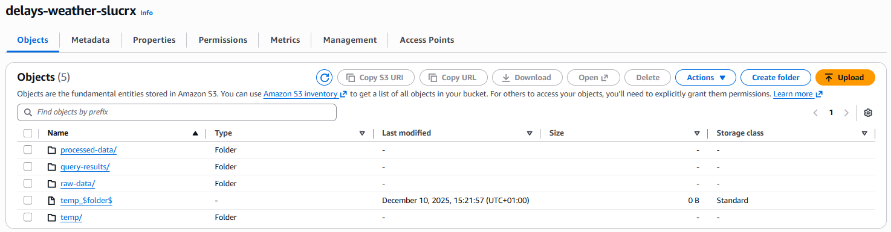 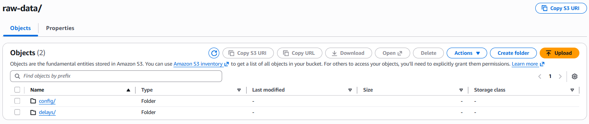 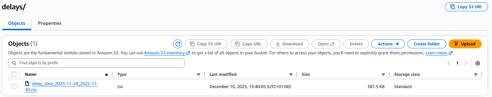 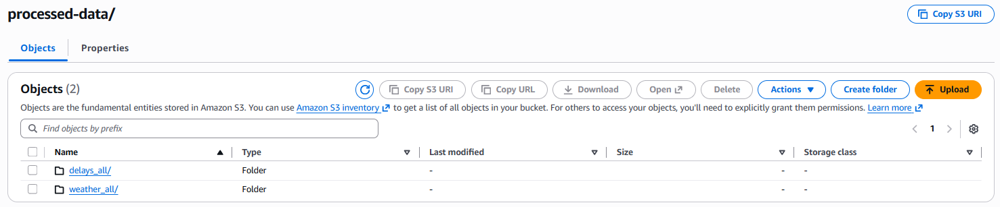

### 2.2 delays_data_initial.csv

-   uploaded to `s3://delays-weather-slucrx/processed-data/delays/`
-   initial load for delays is from 2025-06-01 to 2025-11-23 in CSV format, then weekly data is manually filtered for the week then uploaded to bucket
-   2647 stations\*176 days=203 324 rows with 6 columns

``` csv
date,station_id,station_name,total_delay_minutes,train_count,avg_delay_minutes
2025-06-01,Abaliget,-6,18,-0.3333333333333333
2025-06-01,Abaújszántó,-15,18,-0.8333333333333334
2025-06-01,Abaújszántó fürdő,5,18,0.2777777777777778
[203 321 more rows]
```


### 2.3 weather_data_initial.csv

-   Uploaded to `s3://delays-weather-slucrx/processed-data/weather-all/`
-   Downloaded as CSV separately, as issue with previous suspensions was likely too many API calls, but this could be done in AWS directly as well
-   Daily values for mean temperature, maximum wind gust, sum of precipitation for 8 representative points of regions
-   Initial load is from 2025-06-01 to 2025-11-23 for weather, then weekly appended from API
-   8 regions\*176 days = 1408 rows with 7 columns

``` csv
location_id latitude;longitude;time;temperature_2m_mean (°C);precipitation_sum (mm);wind_gusts_10m_max (km/h)
0;48,1195;20,85;2025-06-01;21,8;1,3; 38,2
0;48,1195;20,85;2025-06-02;23,4;0;38,5
0;48,1195;20,85;2025-06-03;22,5;1,1;42,8
[1405 more rows]
```

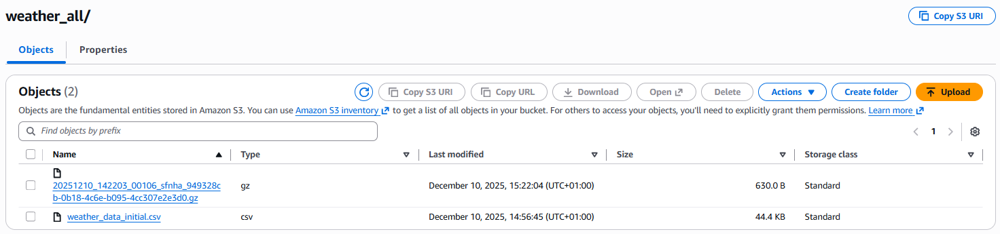

### 2.4 stations_regions.csv

-   This was then converted too a JSON dictionary using R for easier handling: station_coordinates.json
-   R code used is saved as station_regions_preprocessor.R
-   2647 stations of MÁV, each with coordinates, county and NUTS-2 regions it belongs to --\> 2647 x 5
-   Uploaded to: `s3://delays-weather-slucrx/raw-data/config/`

``` csv
    station_name,lat,lon,county,region,station_id
    Aba-Sárkeresztúr,47.023785,18.5425663,Fejér,Közép-Dunántúl,3,29
    Abaliget,46.152688,18.0753148,Baranya,Dél-Dunántúl,5,30
    Abaújkér,48.3088046,21.1980659,Borsod-Abaúj-Zemplén,Észak-Magyarország,0,31
    [2644 more rows]
```


### 2.4 region_coordinates.json

-   Uploaded to: `s3://delays-weather-slucr/config/`
-   Representative coordinates for each region used for weather API calls

``` json
REGIONS = {
    'Észak-Magyarország': {'lat': 48.1, 'lon': 20.8},
    'Észak-Alföld': {'lat': 47.5, 'lon': 21.5},
    'Dél-Alföld': {'lat': 46.5, 'lon': 20.5},
    'Közép-Dunántúl': {'lat': 47.2, 'lon': 18.5},
    'Nyugat-Dunántúl': {'lat': 47.4, 'lon': 17.0},
    'Dél-Dunántúl': {'lat': 46.4, 'lon': 18.2},
    'Budapest': {'lat': 47.5, 'lon': 19.0},
    'Pest': {'lat': 47.4, 'lon': 19.5}
}
```

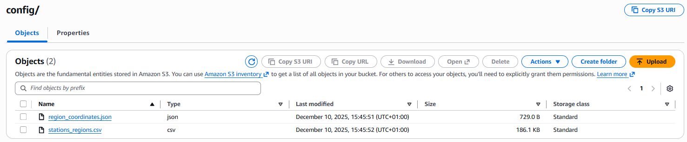

## 3. LAMBDA FUNCTION: query-runner-weekly.py

-   Lambda runs delays-weekly-ETL and delays-weekly-ETL, then runs unified_all-weekly-ETL
-   Trigger set up to look for CSV upload activity in `s3://delays-weather-slucr/raw-data/delays/`
-   Changed default timeout to 5 min, because this function will wait for `weather_all` and `delays_all` updation until starting `unified_all` update

``` python
import boto3
import json
from concurrent.futures import ThreadPoolExecutor, as_completed

glue = boto3.client('glue', region_name='us-east-1')

def start_glue_job(job_name):
    """Start a Glue job and return job run ID"""
    try:
        response = glue.start_job_run(JobName=job_name)
        job_run_id = response['JobRunId']
        print(f"started {job_name}: {job_run_id}")
        return {'job_name': job_name, 'job_run_id': job_run_id, 'status': 'started'}
    except Exception as e:
        print(f"failed to start {job_name}: {str(e)}")
        return {'job_name': job_name, 'status': 'failed', 'error': str(e)}

def wait_for_job_completion(job_name, job_run_id, max_wait_seconds=3600):
    """Poll job status until completion"""
    import time
    
    start_time = time.time()
    while True:
        try:
            response = glue.get_job_run(JobName=job_name, RunId=job_run_id)
            state = response['JobRun']['JobRunState']
            
            if state in ['SUCCEEDED', 'FAILED', 'STOPPED']:
                print(f"{job_name} ({job_run_id}): {state}")
                return {'job_name': job_name, 'job_run_id': job_run_id, 'status': state}
            
            elapsed = time.time() - start_time
            if elapsed > max_wait_seconds:
                print(f"{job_name} ({job_run_id}): timeout after {max_wait_seconds}s")
                return {'job_name': job_name, 'job_run_id': job_run_id, 'status': 'timeout'}
            
            time.sleep(10)
        
        except Exception as e:
            print(f"error polling {job_name}: {str(e)}")
            return {'job_name': job_name, 'job_run_id': job_run_id, 'status': 'error', 'error': str(e)}

def lambda_handler(event, context):
    """
    Run parallel ETL jobs:
    1. delays-update-weekly-ETL (delays ETL)
    2. weather-update-weekly-ETL (weather fetch + CSV upload)
    Then sequentially run:
    3. delays-update-weekly-ETL (unified view)
    """
    
    try:
        print("starting etl orchestration")
        
        # ===== PHASE 1: PARALLEL JOBS =====
        print("\n=== phase 1: starting parallel jobs ===")
        
        parallel_jobs = [
            'weather-update-weekly-ETL',
            'delays-update-weekly-ETL'
        ]
        
        parallel_results = {}
        
        # Start parallel jobs
        with ThreadPoolExecutor(max_workers=2) as executor:
            futures = {executor.submit(start_glue_job, job): job for job in parallel_jobs}
            
            for future in as_completed(futures):
                job_name = futures[future]
                result = future.result()
                parallel_results[job_name] = result
        
        print(f"parallel jobs started: {json.dumps(parallel_results, indent=2)}")
        
        # Wait for parallel jobs to complete
        print("\n=== phase 1: waiting for parallel jobs to complete ===")
        
        parallel_status = {}
        with ThreadPoolExecutor(max_workers=2) as executor:
            futures = {
                executor.submit(
                    wait_for_job_completion, 
                    result['job_name'], 
                    result['job_run_id']
                ): result['job_name'] 
                for result in parallel_results.values() 
                if result['status'] == 'started'
            }
            
            for future in as_completed(futures):
                job_name = futures[future]
                result = future.result()
                parallel_status[job_name] = result
        
        print(f"parallel jobs completed: {json.dumps(parallel_status, indent=2)}")
        
        # Check if all parallel jobs succeeded
        failed_jobs = [job for job, result in parallel_status.items() if result['status'] != 'SUCCEEDED']
        if failed_jobs:
            print(f"warning: some parallel jobs failed: {failed_jobs}")
        
        # ===== PHASE 2: SEQUENTIAL JOB =====
        print("\n=== phase 2: starting sequential job ===")
        
        sequential_job = 'unified_all-weekly-update-ETL'
        seq_result = start_glue_job(sequential_job)
        
        if seq_result['status'] != 'started':
            raise Exception(f"failed to start sequential job: {seq_result.get('error')}")
        
        # Wait for sequential job to complete
        print("\n=== phase 2: waiting for sequential job to complete ===")
        
        seq_completion = wait_for_job_completion(
            seq_result['job_name'], 
            seq_result['job_run_id']
        )
        
        print(f"sequential job completed: {json.dumps(seq_completion, indent=2)}")
        
        # ===== FINAL SUMMARY =====
        print("\n=== ETL orchestration complete ===")
        
        summary = {
            'phase_1_parallel': parallel_status,
            'phase_2_sequential': seq_completion,
            'all_succeeded': (
                all(r['status'] == 'SUCCEEDED' for r in parallel_status.values()) and
                seq_completion['status'] == 'SUCCEEDED'
            )
        }
        
        print(f"summary: {json.dumps(summary, indent=2)}")
        
        return {
            'statusCode': 200,
            'body': json.dumps(summary)
        }
    
    except Exception as e:
        print(f"fatal error in orchestration: {str(e)}")
        import traceback
        traceback.print_exc()
        return {
            'statusCode': 500,
            'body': json.dumps({'error': str(e)})
        }
```

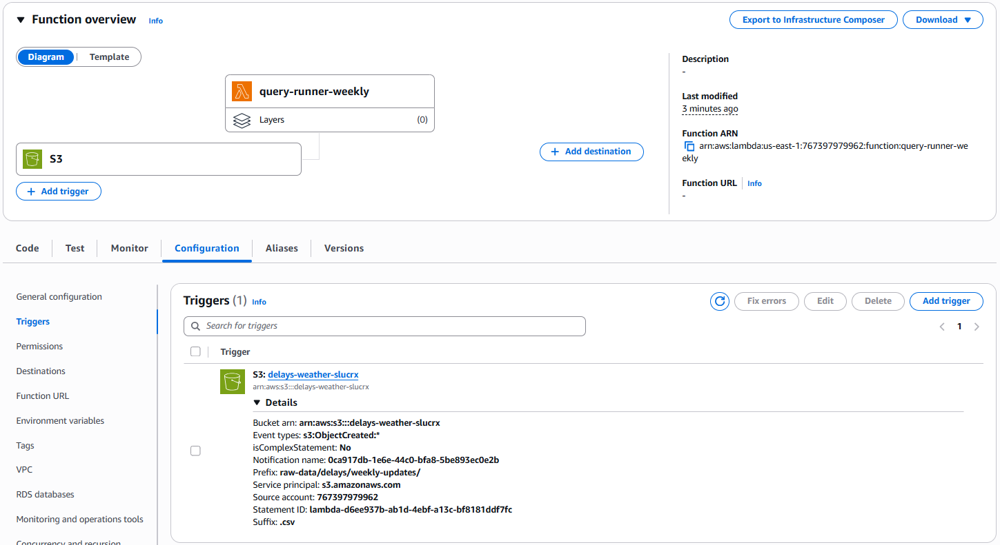

## 4. ETL JOBS

-   CloudWatch logs are used as the logging and monitoring, as the script prints out status updatees about the job to there
-   all jobs directly linked to github for version control and use LabRole for execution, automatic worker scaling is enabled with max 10 workers, G1X workers are used 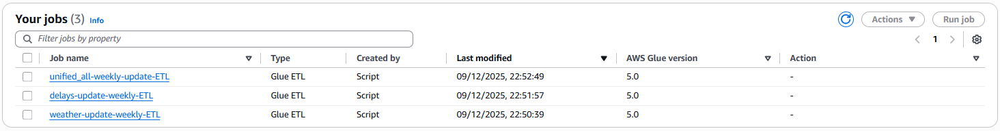

### 4.1 delays-update-weekly-ETL.py

-   appends the new week's delay data to already existing delays_all table in Athena Database from the folder raw-data/delays/weekly-update

``` python
import sys
import re
from awsglue.transforms import *
from awsglue.utils import getResolvedOptions
from pyspark.context import SparkContext
from awsglue.context import GlueContext
from awsglue.job import Job
from pyspark.sql.functions import *
import boto3

args = getResolvedOptions(sys.argv, ['JOB_NAME'])

sc = SparkContext()
glueContext = GlueContext(sc)
spark = glueContext.spark_session
job = Job(glueContext)
job.init(args['JOB_NAME'], args)

s3 = boto3.client('s3')
athena_client = boto3.client('athena', region_name='us-east-1')

BUCKET = 'delays-weather-slucrx'

try:
    print("starting delays-update-weekly-ETL")
    
    # ===== EXTRACT WEEK IDENTIFIER FROM LATEST DELAY CSV =====
    try:
        print("scanning for latest delays CSV filename in weekly-updates")
        response = s3.list_objects_v2(
            Bucket=BUCKET,
            Prefix='raw-data/delays/weekly-updates/'
        )
        
        if 'Contents' not in response or len(response['Contents']) == 0:
            raise Exception("no delay CSV files found in weekly-updates folder")
        
        # Get latest file by modification date
        files = sorted(response['Contents'], key=lambda x: x['LastModified'], reverse=True)
        latest_file = files[0]['Key']  # ← FIX: files[0] not files['Key']
        filename = latest_file.split('/')[-1]
        
        print(f"latest delay file: {filename}")
        
        # Extract dates: delay_data_YYYY-MM-DD_YYYY-MM-DD.csv
        match = re.search(r'delay_data_(\d{4}-\d{2}-\d{2})_(\d{4}-\d{2}-\d{2})', filename)
        
        if not match:
            raise Exception(f"cannot parse date range from filename: {filename}")
        
        START_DATE = match.group(1)
        END_DATE = match.group(2)
        WEEK_IDENTIFIER = f"{START_DATE}_{END_DATE}"
        
        print(f"extracted date range: {START_DATE} to {END_DATE}")
        print(f"week identifier: {WEEK_IDENTIFIER}")
    
    except Exception as e:
        print(f"error extracting week identifier: {str(e)}")
        raise
    
    # ===== READ ONLY THE NEW WEEK'S DELAY CSV =====
    try:
        print(f"reading ONLY new week's delay CSV: delay_data_{WEEK_IDENTIFIER}.csv")
        
        weekly_csv_path = f"s3://{BUCKET}/raw-data/delays/weekly-updates/delay_data_{WEEK_IDENTIFIER}.csv"
        
        df_new_week = spark.read \
            .option("header", "true") \
            .option("inferSchema", "true") \
            .csv(weekly_csv_path)
        
        new_week_count = df_new_week.count()
        print(f"loaded new week's delays: {new_week_count} rows")
        
        if new_week_count == 0:
            raise Exception(f"no data found in: {weekly_csv_path}")
    
    except Exception as e:
        print(f"error reading new week's delays: {str(e)}")
        raise
    
    # ===== SCHEMA VALIDATION & CASTING =====
    try:
        print("applying schema and casting columns")
        df_final = df_new_week.select(
            col("date").cast("date").alias("date"),
            col("station_name").cast("string").alias("station_name"),
            col("station_id").cast("int").alias("station_id"),
            col("total_delay_minutes").cast("double").alias("total_delay_minutes"),
            col("train_count").cast("int").alias("train_count"),
            col("avg_delay_minutes").cast("double").alias("avg_delay_minutes")
        ).repartition(1)
        print("schema casting completed")
    except Exception as e:
        print(f"failed to apply schema: {str(e)}")
        raise
    
    # ===== APPEND NEW WEEK TO processed-data =====
    try:
        output_path = f"s3://{BUCKET}/processed-data/delays_all/"
        print(f"appending new week ({new_week_count} rows) to: {output_path}")
        
        df_final.coalesce(1).write \
            .mode("append") \
            .option("header", "true") \
            .csv(output_path)
        
        print(f"successfully appended {new_week_count} new delay rows to delays_all")
    except Exception as e:
        print(f"failed to append delay data: {str(e)}")
        raise
    
    # ===== REFRESH ATHENA METADATA =====
    try:
        print("running MSCK REPAIR TABLE on delays_all")
        repair_query = "MSCK REPAIR TABLE delays_all"
        response = athena_client.start_query_execution(
            QueryString=repair_query,
            QueryExecutionContext={'Database': 'delays_weather'},
            ResultConfiguration={'OutputLocation': f's3://{BUCKET}/query-results/'}
        )
        query_id = response['QueryExecutionId']
        print(f"MSCK repair started: {query_id}")
    except Exception as e:
        print(f"warning: failed to run MSCK repair: {str(e)}")
    
    print("delays-update-weekly-ETL completed successfully")
    job.commit()

except Exception as e:
    print(f"ETL job failed: {str(e)}")
    import traceback
    traceback.print_exc()
    job.commit()
    sys.exit(1)
```

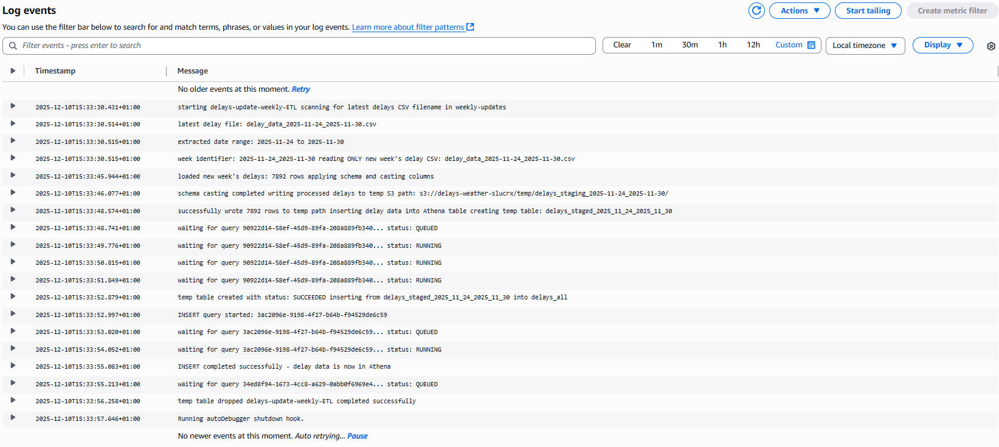 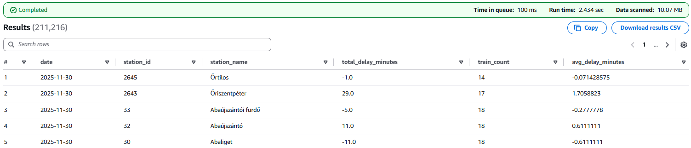

### 4.2 weather-update-weekly-ETL.py

-   API is used to call daily weather data for the 8 regions --\> ETL to add extreme flags --\> added to weather_last_week table in
-   appends the new week's weather data to already existing weather_all table in Athena Database from the folder raw-data/weather/weekly-update where the ETL exported the csv from the API
-   mean temperature, maximum wind gust, sum of precipitation --\> converted to three binary columns: extreme_temperature where mean_temp outside of -5 Celsius and +25 Celsius ; extreme_wind where max gust is above 45 km/h ; extreme_precipitation where sum is above 5 mm
-   only constraint is 5 day lag for factual data, but that is not really problematic

``` python
import sys
import time
import boto3
import json
import requests
import re
from awsglue.context import GlueContext
from awsglue.job import Job
from pyspark.context import SparkContext
from pyspark.sql.functions import col

args = {}
glueContext = GlueContext(SparkContext.getOrCreate())
spark = glueContext.spark_session
job = Job(glueContext)
job.init("weather-update-weekly-ETL", {})

BUCKET = 'delays-weather-slucrx'
API_BASE = 'https://archive-api.open-meteo.com/v1/archive'

s3 = boto3.client('s3')
athena_client = boto3.client('athena', region_name='us-east-1')

def wait_for_query_completion(client, query_id, max_retries=120):
    """Wait for Athena query to complete"""
    for attempt in range(max_retries):
        try:
            response = client.get_query_execution(QueryExecutionId=query_id)
            status = response['QueryExecution']['Status']['State']
            
            if status in ['SUCCEEDED', 'FAILED', 'CANCELLED']:
                return status
            
            print(f"  waiting for query {query_id}... status: {status}")
            time.sleep(1)
        except Exception as e:
            print(f"  error checking query status: {str(e)}")
            time.sleep(1)
    
    raise Exception(f"query {query_id} did not complete after {max_retries} attempts")

try:
    print("starting weather-update-weekly-ETL")

    # ===== EXTRACT WEEK IDENTIFIER FROM LATEST DELAY CSV =====
    try:
        print("scanning for latest delays CSV filename to extract date range")
        response = s3.list_objects_v2(
            Bucket=BUCKET,
            Prefix='raw-data/delays/weekly-updates/'
        )

        if 'Contents' not in response or len(response['Contents']) == 0:
            raise Exception("no delay CSV files found in weekly-updates folder")

        # Get latest file by modification date
        files = sorted(response['Contents'], key=lambda x: x['LastModified'], reverse=True)
        latest_file = files[0]['Key']
        filename = latest_file.split('/')[-1]

        print(f"latest delay file: {filename}")

        # Extract dates: delay_data_YYYY-MM-DD_YYYY-MM-DD.csv
        match = re.search(r'delay_data_(\d{4}-\d{2}-\d{2})_(\d{4}-\d{2}-\d{2})', filename)

        if not match:
            raise Exception(f"cannot parse date range from filename: {filename}")

        START_DATE = match.group(1)
        END_DATE = match.group(2)
        WEEK_IDENTIFIER = f"{START_DATE}_{END_DATE}"

        print(f"extracted date range: {START_DATE} to {END_DATE}")
        print(f"week identifier: {WEEK_IDENTIFIER}")

    except Exception as e:
        print(f"error extracting week identifier: {str(e)}")
        raise

    # ===== LOAD REGION COORDINATES =====
    try:
        print("loading region coordinates from config")
        response = s3.get_object(
            Bucket=BUCKET,
            Key='raw-data/weather/region_coordinates.json'
        )
        data = json.loads(response['Body'].read().decode('utf-8'))
        REGIONS = data['regions']  # Extract the regions list
        print(f"loaded {len(REGIONS)} regions")
    except Exception as e:
        print(f"error loading regions config: {str(e)}")
        raise

    # ===== FETCH WEATHER FROM API FOR THE NEW WEEK =====
    try:
        print(f"fetching weather from API for {len(REGIONS)} regions (dates: {START_DATE} to {END_DATE})")
        all_weather = []

        # region_id is derived from the order of REGIONS (0,1,2,...)
        for region_id, region_data in enumerate(REGIONS):
            try:
                region_name = region_data['region_name']
                coords = {'lat': region_data['lat'], 'lon': region_data['lon']}
                
                print(f"  fetching: {region_name} (region_id={region_id})")

                params = {
                    'latitude': coords['lat'],
                    'longitude': coords['lon'],
                    'start_date': START_DATE,
                    'end_date': END_DATE,
                    'daily': 'temperature_2m_mean,wind_gusts_10m_max,precipitation_sum',
                    'timezone': 'auto'
                }

                response = requests.get(API_BASE, params=params, timeout=420)
                response.raise_for_status()
                data = response.json()

                times = data['daily']['time']
                temps = data['daily']['temperature_2m_mean']
                winds = data['daily']['wind_gusts_10m_max']
                precips = data['daily']['precipitation_sum']

                for i, date_str in enumerate(times):
                    t = float(temps[i])
                    w = float(winds[i])
                    p = float(precips[i])

                    record = {
                        'region_id': region_id,
                        'date': date_str,
                        'temperature_mean_c': t,
                        'wind_gust_max_kmh': w,
                        'precipitation_sum_mm': p,
                        'high_temp': 1 if (t < -5 or t > 25) else 0,
                        'high_wind': 1 if w > 45 else 0,
                        'high_precip': 1 if p > 5 else 0
                    }
                    all_weather.append(record)

            except Exception as e:
                print(f"    error fetching {region_name}: {str(e)}")
                raise

        if not all_weather:
            raise Exception("no weather data fetched from API")

        print(f"total records fetched from API: {len(all_weather)}")

    except Exception as e:
        print(f"error fetching weather from API: {str(e)}")
        raise

    # ===== SCHEMA VALIDATION & CASTING (DIRECT TO PROCESSED-DATA) =====
    try:
        print("applying schema and casting columns")
        
        df_weather = spark.createDataFrame(all_weather)
        
        df_final = df_weather.select(
            col("region_id").cast("int").alias("region_id"),
            col("date").cast("date").alias("date"),
            col("temperature_mean_c").cast("double").alias("temperature_mean_c"),
            col("wind_gust_max_kmh").cast("double").alias("wind_gust_max_kmh"),
            col("precipitation_sum_mm").cast("double").alias("precipitation_sum_mm"),
            col("high_temp").cast("int").alias("high_temp"),
            col("high_wind").cast("int").alias("high_wind"),
            col("high_precip").cast("int").alias("high_precip")
        ).repartition(1)
        
        print("schema casting completed")
    except Exception as e:
        print(f"failed to apply schema: {str(e)}")
        raise

    # ===== WRITE DIRECTLY TO TEMP PATH IN S3 =====
    try:
        temp_s3_path = f"s3://{BUCKET}/temp/weather_staging_{WEEK_IDENTIFIER}/"
        print(f"writing processed weather to temp S3 path: {temp_s3_path}")

        df_final.coalesce(1).write \
            .mode("overwrite") \
            .option("header", "true") \
            .csv(temp_s3_path)

        print(f"successfully wrote {len(all_weather)} rows to temp path")
    except Exception as e:
        print(f"error writing to temp path: {str(e)}")
        raise

        # ===== INSERT INTO ATHENA TABLE (DIRECT METHOD) =====
    try:
        print("inserting weather data into Athena table")
        
        # Step 1: Create temporary external table pointing to staged data
        temp_table_name = f"weather_staged_{WEEK_IDENTIFIER.replace('-', '_')}"
        
        create_temp_query = f"""
        CREATE EXTERNAL TABLE IF NOT EXISTS {temp_table_name} (
            region_id INT,
            date DATE,
            temperature_mean_c DOUBLE,
            wind_gust_max_kmh DOUBLE,
            precipitation_sum_mm DOUBLE,
            high_temp INT,
            high_wind INT,
            high_precip INT
        )
        ROW FORMAT SERDE 'org.apache.hadoop.hive.serde2.lazy.LazySimpleSerDe'
        WITH SERDEPROPERTIES ('field.delim' = ',')
        STORED AS TEXTFILE
        LOCATION 's3://{BUCKET}/temp/weather_staging_{WEEK_IDENTIFIER}/'
        TBLPROPERTIES ('skip.header.line.count' = '1')
        """
        
        print(f"creating temp table: {temp_table_name}")
        response = athena_client.start_query_execution(
            QueryString=create_temp_query,
            QueryExecutionContext={'Database': 'delays_weather'},
            ResultConfiguration={'OutputLocation': f's3://{BUCKET}/query-results/'}
        )
        query_id = response['QueryExecutionId']
        status = wait_for_query_completion(athena_client, query_id)
        print(f"temp table created with status: {status}")
        
        # Step 2: Insert from temp table into weather_all
        insert_query = f"""
        INSERT INTO weather_all
        SELECT 
            region_id,
            date,
            temperature_mean_c,
            wind_gust_max_kmh,
            precipitation_sum_mm,
            high_temp,
            high_wind,
            high_precip
        FROM {temp_table_name}
        """
        
        print(f"inserting from {temp_table_name} into weather_all")
        response = athena_client.start_query_execution(
            QueryString=insert_query,
            QueryExecutionContext={'Database': 'delays_weather'},
            ResultConfiguration={'OutputLocation': f's3://{BUCKET}/query-results/'}
        )
        query_id = response['QueryExecutionId']
        print(f"INSERT query started: {query_id}")
        
        status = wait_for_query_completion(athena_client, query_id)
        
        if status == 'SUCCEEDED':
            print(f"INSERT completed successfully - weather data is now in Athena")
        else:
            print(f"warning: INSERT query returned status: {status}")
        
        # Step 3: Drop temporary table
        drop_temp_query = f"DROP TABLE IF EXISTS {temp_table_name}"
        response = athena_client.start_query_execution(
            QueryString=drop_temp_query,
            QueryExecutionContext={'Database': 'delays_weather'},
            ResultConfiguration={'OutputLocation': f's3://{BUCKET}/query-results/'}
        )
        query_id = response['QueryExecutionId']
        wait_for_query_completion(athena_client, query_id)
        print(f"temp table dropped")
        
    except Exception as e:
        print(f"error with INSERT into weather_all: {str(e)}")
        raise

    print("weather-update-weekly-ETL completed successfully")

except Exception as e:
    print(f"ETL job failed: {str(e)}")
    import traceback
    traceback.print_exc()
    raise

finally:
    job.commit()
```

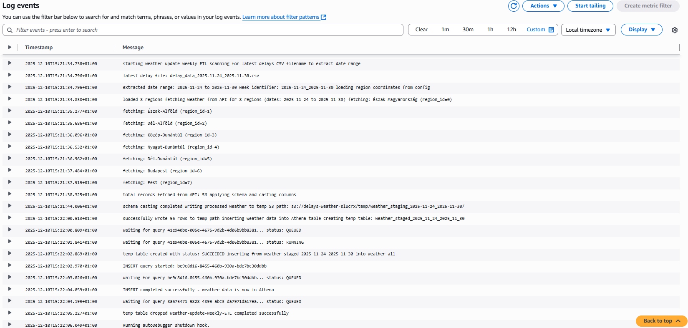 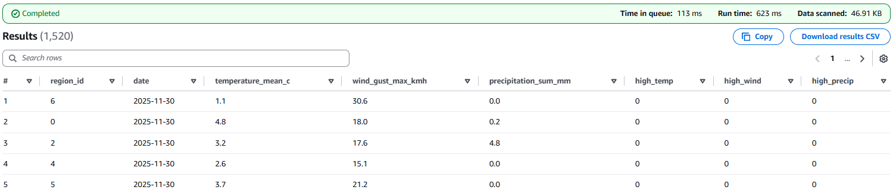

### 4.3 unified_all-weekly-update-ETL.py

-   after delays and weather are imported to database the unified_all view is also updated

``` python
import sys
import boto3
import time
from awsglue.transforms import *
from awsglue.utils import getResolvedOptions
from pyspark.context import SparkContext
from awsglue.context import GlueContext
from awsglue.job import Job

args = getResolvedOptions(sys.argv, ['JOB_NAME'])

sc = SparkContext()
glueContext = GlueContext(sc)
spark = glueContext.spark_session
job = Job(glueContext)
job.init(args['JOB_NAME'], args)

athena_client = boto3.client('athena', region_name='us-east-1')

try:
    print("starting unified_all view refresh ETL job")
    
    # Create or replace unified_all view
    try:
        print("refreshing unified_all view")
        
        view_query = """
        CREATE OR REPLACE VIEW unified_all AS
        SELECT 
            d.date,
            d.station_name,
            sr.region,
            sr.county,
            d.total_delay_minutes,
            d.train_count,
            d.avg_delay_minutes,
            w.temperature_mean_c,
            w.wind_gust_max_kmh,
            w.precipitation_sum_mm,
            w.extreme_temperature,
            w.extreme_wind,
            w.extreme_precipitation
        FROM delays_all d
        LEFT JOIN stations_regions sr 
            ON d.station_name = sr.station_name
        LEFT JOIN weather_all w 
            ON d.date = w.date 
            AND sr.region = w.station_name
        ORDER BY d.date, d.station_name;
        """
        
        response = athena_client.start_query_execution(
            QueryString=view_query,
            QueryExecutionContext={'Database': 'delays_weather'},
            ResultConfiguration={'OutputLocation': 's3://delays-weather-slucrx/query-results/'}
        )
        
        query_id = response['QueryExecutionId']
        print(f"view refresh query started: {query_id}")
        
        # Poll for completion
        max_attempts = 60
        for attempt in range(max_attempts):
            query_status = athena_client.get_query_execution(QueryExecutionId=query_id)
            status = query_status['QueryExecution']['Status']['State']
            
            if status in ['SUCCEEDED', 'FAILED', 'CANCELLED']:
                print(f"view refresh query status: {status}")
                if status == 'FAILED':
                    reason = query_status['QueryExecution']['Status']['StateChangeReason']
                    raise Exception(f"query failed: {reason}")
                break
            
            time.sleep(2)
        
        if status != 'SUCCEEDED':
            raise Exception(f"query did not complete: {status}")
        
        print("unified_all view successfully refreshed")
    
    except Exception as e:
        print(f"failed to refresh unified_all view: {str(e)}")
        raise
    
    # Commit job
    try:
        print("committing glue job")
        job.commit()
        print("etl job completed successfully")
    except Exception as e:
        print(f"failed to commit job: {str(e)}")
        raise

except Exception as e:
    print(f"ETL job failed with error: {str(e)}")
    job.commit()
    sys.exit(1)
```

## 5. ATHENA QUERIES

### 5.1 specifying output bucket

> `s3://delays-weather-slucrx/query-results`

|  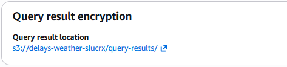

### 5.2 database creation

-   After creation, selected in Data panel to become default database and have my tables created in this one.

``` sql
CREATE DATABASE delays_weather
```

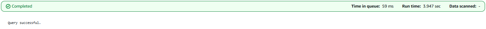

### 5.3 delays_all TABLE first creation

``` sql
CREATE EXTERNAL TABLE delays_all (
    date DATE,
    station_id INT,
    station_name STRING,
    total_delay_minutes FLOAT,
    train_count INT,
    avg_delay_minutes FLOAT
)
ROW FORMAT SERDE 'org.apache.hadoop.hive.serde2.lazy.LazySimpleSerDe'
WITH SERDEPROPERTIES ('field.delim' = ',')
STORED AS TEXTFILE
LOCATION 's3://delays-weather-slucrx/raw-data/delays/initial/'
TBLPROPERTIES ('has_encrypted_data' = 'false', 'skip.header.line.count' = '1');
```

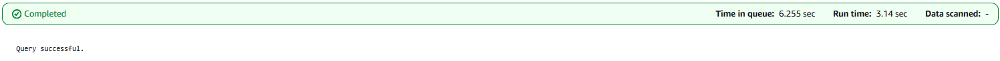

#### Check the contents of delays_all: succesful initial data import

``` sql
SELECT * FROM delays_all;
```

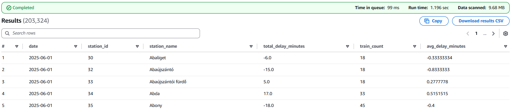

### 5.4 weather_all TABLE creation

``` sql
CREATE EXTERNAL TABLE weather_all (
    region_id INT,    
    date DATE,
    temperature_mean_c DOUBLE,
    precipitation_sum_mm DOUBLE,
    wind_gust_max_kmh DOUBLE,
    high_temp INT,
    high_wind INT,
    high_precip INT
)
ROW FORMAT SERDE 'org.apache.hadoop.hive.serde2.lazy.LazySimpleSerDe'
WITH SERDEPROPERTIES ('field.delim' = '\\;')
STORED AS TEXTFILE
LOCATION 's3://delays-weather-slucrx/raw-data/weather/initial/'
TBLPROPERTIES ('has_encrypted_data' = 'false', 'skip.header.line.count' = '1');
```

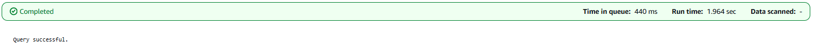

#### Check the contents of weather_all: successful initial data import

``` sql
SELECT * FROM weather_all;
```

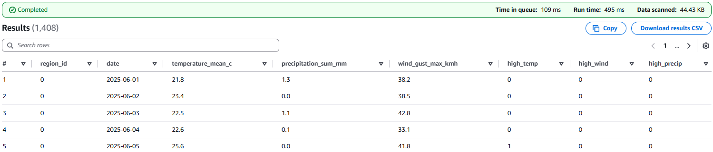

### 5.5 stations_regions TABLE creation

``` sql
CREATE EXTERNAL TABLE stations_regions (
    station_name STRING,
    latitude DOUBLE,
    longitude DOUBLE,
    county STRING,
    region STRING,
    region_id INT
)
ROW FORMAT SERDE 'org.apache.hadoop.hive.serde2.lazy.LazySimpleSerDe'
WITH SERDEPROPERTIES ('field.delim' = ',')
STORED AS TEXTFILE
LOCATION 's3://delays-weather-slucrx/raw-data/weather/station-region'
TBLPROPERTIES ('has_encrypted_data' = 'false', 'skip.header.line.count' = '1');
```

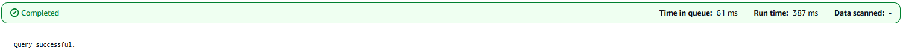

#### Check the contents of delstations_regions: successful initial data import (first 28 IDs are for really specific stations with only codes as names)

``` sql
SELECT * FROM stations_regions WHERE station_id>28;
```

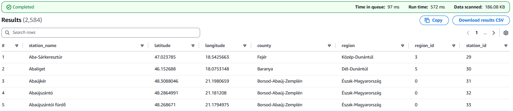

### 5.6 unified_all VIEW creation

-   Where station_id is null, the station is for replacement buses, not include those rows as cannot join weather to them without ID

``` sql
CREATE OR REPLACE VIEW unified_all AS
SELECT 
    d.date,
    d.station_name,
    sr.county,
    sr.region,
    d.total_delay_minutes,
    d.train_count,
    d.avg_delay_minutes,
    w.high_temp,
    w.high_wind,
    w.high_precip
FROM delays_all d
LEFT JOIN stations_regions sr 
    ON d.station_id = sr.station_id
LEFT JOIN weather_all w 
    ON d.date = w.date 
   AND sr.region_id = w.region_id
WHERE d.station_id IS NOT NULL
ORDER BY d.date, d.station_name;
```

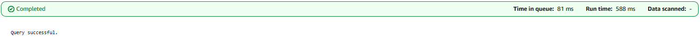

#### Check the contents of unified_all: successful merging of the two data streams, data loss due to temporary bus replacements

``` sql
SELECT * FROM unified_all;
```

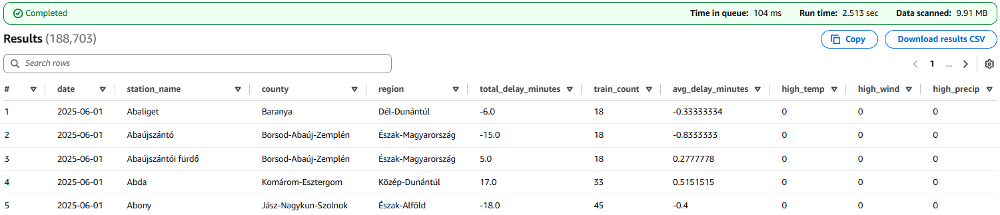

## 6. KPI QUERIES

### 6.1 MEDIAN DELAYS

``` sql
SELECT 
    region,
    ROUND(APPROX_PERCENTILE(
        CASE WHEN avg_delay_minutes > 5 THEN avg_delay_minutes END, 0.5), 2) as median_delay,
    ROUND(APPROX_PERCENTILE(
        CASE WHEN high_temp = 1 AND avg_delay_minutes > 5 THEN avg_delay_minutes END, 0.5), 2) as median_high_temp,
    ROUND(APPROX_PERCENTILE(
        CASE WHEN high_wind = 1 AND avg_delay_minutes > 5 THEN avg_delay_minutes END, 0.5), 2) as median_high_wind,
    ROUND(APPROX_PERCENTILE(
        CASE WHEN high_precip = 1 AND avg_delay_minutes > 5 THEN avg_delay_minutes END, 0.5), 2) as median_high_precip,
    COUNT(DISTINCT date) as days_tracked
FROM unified_all
GROUP BY region
ORDER BY median_delay DESC;
```


### 6.2 DELAYS SCORE

``` sql
SELECT 
    station_name,
    region,
    COUNT(*) as observed_days,
    COUNT(CASE WHEN avg_delay_minutes > 5 THEN 1 ELSE 0 END) as delayed_days,
    ROUND(100.0 * COUNT(CASE WHEN avg_delay_minutes > 5 THEN 1 ELSE 0 END) / COUNT(*), 2) as percent_delayed_days
FROM unified_all
GROUP BY station_name, region
ORDER BY percent_delayed_days DESC
LIMIT 10;
```


### 6.3 RESILIENCE SCORE

``` sql
SELECT 
    station_name,
    region,
    COUNT(*) as observed_days,
    COUNT(DISTINCT CASE WHEN high_temp = 1 OR high_wind = 1 OR high_precip = 1 THEN date END) 
        as extreme_weather_days,
    COUNT(DISTINCT CASE 
        WHEN (high_temp = 1 OR high_wind = 1 OR high_precip = 1) 
            AND avg_delay_minutes <= (
                SELECT AVG(avg_delay_minutes)
                FROM unified_all
                WHERE high_temp = 0 AND high_wind = 0 AND high_precip = 0
            )
        THEN date 
    END) as resilient_days,
    ROUND(
        CAST(COUNT(DISTINCT CASE 
                WHEN (high_temp = 1 OR high_wind = 1 OR high_precip = 1) 
                AND avg_delay_minutes <= (
                    SELECT AVG(avg_delay_minutes)
                    FROM unified_all
                    WHERE high_temp = 0 AND high_wind = 0 AND high_precip = 0
                )
                THEN date 
            END) AS DOUBLE) /
        NULLIF(COUNT(DISTINCT CASE WHEN high_temp = 1 OR high_wind = 1 OR high_precip = 1 THEN date END), 0) 
        * 100, 1
    ) as resilience_score_pct
FROM unified_all
GROUP BY station_name, region
ORDER BY resilience_score_pct ASC
LIMIT 10;
```


## 7. WEEK1 UPDATE SCREENSHOTS

### 7.1 uploaded `delay_data_2025-12-01_2025-12-07.csv` to `raw-data/delays/`

-   UPLOAD OF NEW WEEKLY DELAY DATA 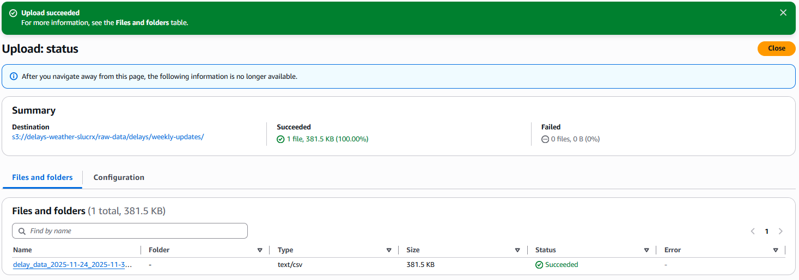

-   query-runner-weekly LAMBDA TRIGGERED 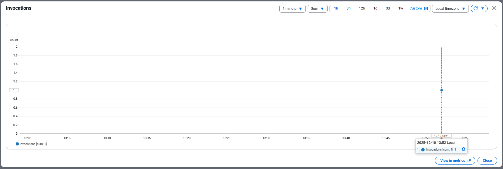

### 7.2 weather-update-weekly-ETL SUCEEDED

-   LOG OF SUCCESFUL RUN 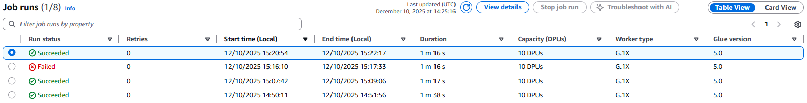 

-   weather_all TABLE HAS THE NEW DATA 

### 7.3 delays-update-weekly-ETL SUCEEDED

-   LOG OF SUCCESSFUL RUN 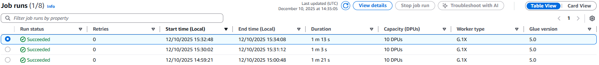 \

Open-Meteo Weather API (historical + daily updates; 8 representative regional coordinates)

Station metadata (2,647 stations with coordinates, county, and NUTS-2 region mappings)

Storage Layer (S3 Bucket: delays-weather-slucrx):

Raw data paths: raw-data/delays/initial/, raw-data/delays/weekly-updates/

Weather data: raw-data/weather/initial/, raw-data/weather/weekly-update/

Station/region info: raw-data/weather/station-region/

Processed outputs: processed-data/delays_all/

Query results: query-results/

Data Processing (AWS Glue ETL Jobs):

delays-update-weekly-ETL – Filters positive delays (≥0 minutes), aggregates by date and station, joins station metadata, appends to delays_all table

weather-update-weekly-ETL – Fetches weekly weather data from API, applies extreme weather flags (temperature outside -5°C to +25°C, wind gusts \>45 km/h, precipitation \>5 mm), stages data and inserts into weather_all table

unified_all-weekly-update-ETL – Creates/refreshes unified view by joining delays_all, stations_regions, and weather_all tables using date and region keys

Orchestration (AWS Lambda):

query-runner-weekly.py – Triggered by CSV uploads to weekly-updates folder; executes delays and weather ETL jobs in parallel (2-minute timeout), then runs unified_all update sequentially (5-minute timeout)

Query & Analytics (Amazon Athena):

Database: delays_weather

External tables: delays_all, weather_all, stations_regions

View: unified_all (joins all three tables for comprehensive analysis)

Output location: s3://delays-weather-slucrx/query-results/

### Cost Breakdown

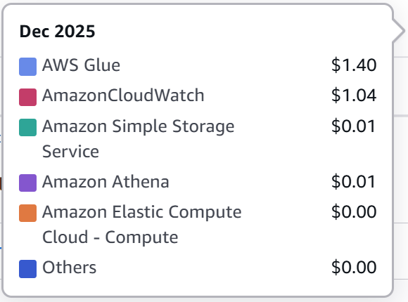

### Business Goal Support

-   Incorporating data-driven decision making drives efficient spending of tight maintanenca budget
-   Easy to use: only weekly upload of delays csv is needed, everything else is automatic
-   Can be appended later on for more sophisticated variable tracking, this is a solid base platform for Data Warehouse implementation

AI: Targeted infrastructure investment – Unified data enables queries identifying regions and stations with highest delays and strongest weather correlation

Scalable weekly updates – Serverless architecture automatically processes new delay and weather data without manual intervention or fixed infrastructure costs

Historical + real-time analysis – Initial load provides baseline; weekly updates maintain current insights for trend tracking and emerging problem detection

Low operational overhead – Combined monthly cost of \$0.08 allows sustained analytics without heavy capital expenditure, aligning with MÁV's budget constraints

# 1. PREPROCESS R SCRIPTS

## 1.1 delay_data_preprocessor.R

-   for initial, then used for week 1 (11-24 to 11-30) and week 2 (12-01 to 12-07)
-   could not upload ProcData.rds to GitHub as it is too large (\>25 MB)

``` r
library(dplyr)
library(readr)
library(stringr)
library(jsonlite)

## READ-IN STATION_IDs from LOOKUP JSON
stations_lookup <- fromJSON("stations_ids.json")

# DEFINE MAIN PART AS FUNCTION
process_delay_data <- function(input_file, start_date, end_date, output_file) {
  print(paste("processing:", start_date, "to", end_date))
  
  raw_delay_data <- readRDS(input_file)
  
  # Filter by date range
  raw_delay_data <- raw_delay_data[
    raw_delay_data$Datum >= start_date & 
    raw_delay_data$Datum <= end_date, 
  ]
  
  # Extract station names based on Tipus
  raw_delay_data <- raw_delay_data %>%
    mutate(
      station_name = case_when(
        Tipus == "Szakasz" ~ NA_character_,
        Tipus %in% c("InduloAllomas", "KozbensoAllomas") ~ Indulo,
        Tipus == "ZaroSzakasz" ~ Erkezo,
        TRUE ~ NA_character_
      )
    ) %>%
    filter(!is.na(station_name)) %>%
    filter(station_name != "")
  
  # Rename and clean columns
  raw_delay_data <- raw_delay_data %>%
    rename(date = Datum, delay = Keses) %>%
    select(date, station_name, delay) %>%
    mutate(
      date = as.Date(date),
      station_name = str_trim(str_replace_all(station_name, '"', "")),
      delay = as.numeric(delay)
    )
  
  # FILTER: Keep ONLY positive delays (delay >= 0)
  total_before <- nrow(raw_delay_data)
  raw_delay_data <- raw_delay_data %>%
    filter(delay >= 0)
  total_after <- nrow(raw_delay_data)
  removed <- total_before - total_after
  
  print(paste("Removed", removed, "early arrivals (delay < 0)"))
  print(paste("Kept", total_after, "on-time or delayed records"))
  print(paste("Percentage kept:", round(100 * total_after / total_before, 1), "%"))
  
  # Aggregate by date and station
  delay_aggregated <- raw_delay_data %>%
    group_by(date, station_name) %>%
    summarise(
      total_delay_minutes = sum(delay, na.rm = TRUE),
      train_count = n(),
      avg_delay_minutes = mean(delay, na.rm = TRUE),
      .groups = 'drop'
    ) %>%
    arrange(date, station_name)
  
  # Join with station lookup
  delay_aggregated <- delay_aggregated %>%
    left_join(stations_lookup, by = "station_name") %>%
    select(
      date,
      station_id,
      station_name,
      total_delay_minutes,
      train_count,
      avg_delay_minutes
    ) %>%
    arrange(date, station_name)
  
  write_csv(delay_aggregated, output_file, na = "")
  print(paste("success:", output_file))
  print(paste("Total rows written:", nrow(delay_aggregated)))
}

# RUNS
process_delay_data("ProcData.rds", "2025-06-01", "2025-11-23", "delay_data_initial.csv")
process_delay_data("ProcData.rds", "2025-11-24", "2025-11-30", "delay_data_2025-11-24_2025-11-30.csv")
process_delay_data("ProcData.rds", "2025-12-01", "2025-12-07", "delay_data_2025-12-01_2025-12-07.csv")
```

### for initial data

```         
[1] "processing: 2025-06-01 to 2025-11-23"
[1] "Removed 1881276 early arrivals (delay < 0)"
[1] "Kept 5281621 on-time or delayed records"
[1] "Percentage kept: 73.7 %"
[1] "success: delay_data_initial.csv"
[1] "Total rows written: 190147"
```

### for WEEK1 data

```         
[1] "processing: 2025-11-24 to 2025-11-30"
[1] "Removed 74583 early arrivals (delay < 0)"
[1] "Kept 204762 on-time or delayed records"
[1] "Percentage kept: 73.3 %"
[1] "success: delay_data_2025-11-24_2025-11-30.csv"
[1] "Total rows written: 7590"
```

### for WEEK2 data

```         
[1] "processing: 2025-12-01 to 2025-12-07"
[1] "Removed 73138 early arrivals (delay < 0)"
[1] "Kept 207556 on-time or delayed records"
[1] "Percentage kept: 73.9 %"
[1] "success: delay_data_2025-12-01_2025-12-07.csv"
[1] "Total rows written: 7580"
```

## 1.2 station_regions_preprocessor.R

``` r
## LIBRARY & READ RDS DATA ---------------------------------------------------
library(jsonlite)
stations_df <- readRDS("allomaskoord.rds")

# RENAME AND SELECT COLUMNS
names(stations_df)[names(stations_df) == "Allomas"] <- "station_name"
head(stations_df)

# DEFINE COUNTY BOUNDING BOXES (LAT/LON RANGES) ------------------------------
COUNTY_BOUNDS <- list(
    "Budapest" = list(lat_min = 47.37, lat_max = 47.63, lon_min = 18.92, lon_max = 19.28),
  "Borsod-Abaúj-Zemplén" = list(lat_min = 47.8, lat_max = 48.7, lon_min = 20.2, lon_max = 21.5),
  "Heves" = list(lat_min = 47.3, lat_max = 48.2, lon_min = 19.7, lon_max = 20.8),
  "Nógrád" = list(lat_min = 47.7, lat_max = 48.7, lon_min = 18.8, lon_max = 20.2),
  "Hajdú-Bihar" = list(lat_min = 46.9, lat_max = 47.8, lon_min = 20.6, lon_max = 22.2),
  "Jász-Nagykun-Szolnok" = list(lat_min = 46.7, lat_max = 47.5, lon_min = 19.8, lon_max = 21.0),
  "Szabolcs-Szatmár-Bereg" = list(lat_min = 47.5, lat_max = 48.6, lon_min = 21.1, lon_max = 22.9),
  "Bács-Kiskun" = list(lat_min = 45.8, lat_max = 47.0, lon_min = 18.6, lon_max = 20.3),
  "Békés" = list(lat_min = 46.1, lat_max = 47.2, lon_min = 20.5, lon_max = 21.9),
  "Csongrád-Csanád" = list(lat_min = 46.1, lat_max = 47.0, lon_min = 19.8, lon_max = 20.9),
  "Fejér" = list(lat_min = 46.8, lat_max = 47.4, lon_min = 18.0, lon_max = 19.3),
  "Komárom-Esztergom" = list(lat_min = 47.3, lat_max = 47.9, lon_min = 17.5, lon_max = 18.9),
  "Veszprém" = list(lat_min = 46.6, lat_max = 47.8, lon_min = 17.0, lon_max = 18.6),
  "Győr-Moson-Sopron" = list(lat_min = 47.2, lat_max = 48.1, lon_min = 16.3, lon_max = 18.0),
  "Vas" = list(lat_min = 46.7, lat_max = 47.8, lon_min = 15.9, lon_max = 17.3),
  "Zala" = list(lat_min = 45.8, lat_max = 47.2, lon_min = 15.9, lon_max = 17.4),
  "Baranya" = list(lat_min = 45.8, lat_max = 46.6, lon_min = 17.2, lon_max = 18.9),
  "Somogy" = list(lat_min = 45.8, lat_max = 47.0, lon_min = 17.0, lon_max = 18.5),
  "Tolna" = list(lat_min = 46.2, lat_max = 46.9, lon_min = 18.2, lon_max = 19.4),
  "Pest" = list(lat_min = 47.0, lat_max = 48.0, lon_min = 18.6, lon_max = 20.2)
)

# DEFINE ASSIGNMENT FUNCTIONS ------------------------------------------------
# assign county based on lat/lon bounds
assign_county <- function(lat, lon) {
  for (county_name in names(COUNTY_BOUNDS)) {
    bounds <- COUNTY_BOUNDS[[county_name]]
    
    if (lat >= bounds$lat_min & lat <= bounds$lat_max &
        lon >= bounds$lon_min & lon <= bounds$lon_max) {
      return(county_name)
    }
  }
  return(NA)
}

# assign NUTS-2 region based on county
assign_region <- function(county) {
  region_map <- list(
    "Borsod-Abaúj-Zemplén" = "Észak-Magyarország",
    "Heves" = "Észak-Magyarország",
    "Nógrád" = "Észak-Magyarország",
    "Hajdú-Bihar" = "Észak-Alföld",
    "Jász-Nagykun-Szolnok" = "Észak-Alföld",
    "Szabolcs-Szatmár-Bereg" = "Észak-Alföld",
    "Bács-Kiskun" = "Dél-Alföld",
    "Békés" = "Dél-Alföld",
    "Csongrád-Csanád" = "Dél-Alföld",
    "Fejér" = "Közép-Dunántúl",
    "Komárom-Esztergom" = "Közép-Dunántúl",
    "Veszprém" = "Közép-Dunántúl",
    "Győr-Moson-Sopron" = "Nyugat-Dunántúl",
    "Vas" = "Nyugat-Dunántúl",
    "Zala" = "Nyugat-Dunántúl",
    "Baranya" = "Dél-Dunántúl",
    "Somogy" = "Dél-Dunántúl",
    "Tolna" = "Dél-Dunántúl",
    "Pest" = "Pest",
    "Budapest" = "Budapest"
  )
  return(region_map[[county]] %||% NA)
}

# assign location_id based on region (this is from the initial API order, acts like region FK in weather data)
assign_location_id <- function(region) {
  location_id_map <- list(
    "Észak-Magyarország" = 0,
    "Észak-Alföld" = 1,
    "Dél-Alföld" = 2,
    "Közép-Dunántúl" = 3,
    "Nyugat-Dunántúl" = 4,
    "Dél-Dunántúl" = 5,
    "Budapest" = 6,
    "Pest" = 7
  )
  return(location_id_map[[region]] %||% NA)
}

## ADD COUNTY, REGION AND LOCATION_ID COLUMNS ---------------------------------------------
stations_df$county <- mapply(assign_county, stations_df$lat, stations_df$lon)
stations_df$region <- mapply(assign_region, stations_df$county)
stations_df$location_id <- mapply(assign_location_id, stations_df$region)
head(stations_df)

# check if there are stations with NA counties
stations_df$station_name[is.na(stations_df$county)]
# none found

## EXPORT TO CSV ------------------------------------------------------------
write_csv(stations_df[, c("station_name", "lat", "lon", "county", "region", "location_id")], "stations_regions.csv")
print("successful transformation, CSV exported")
```

# 2. BUCKET CREATION AND DATA UPLOAD

## 2.1 bucket creation

-   name: delays-weather-slucrx
-   otherwise default settings     

## 2.2 delays_data_initial.csv

-   delays source: https://github.com/ferenci-tamas/vonat-keses/blob/main/data/ProcData.rds
-   uploaded to s3://delays-weather-slucrx/raw-data/delays/initial
-   initial load for delays is from 2025-06-01 to 2025-11-23 in CSV format, then weekly data is manually filtered for the week then uploaded to bucket

``` csv
date,station_id,station_name,total_delay_minutes,train_count,avg_delay_minutes
2025-06-01,Abaliget,-6,18,-0.3333333333333333
2025-06-01,Abaújszántó,-15,18,-0.8333333333333334
2025-06-01,Abaújszántó fürdő,5,18,0.2777777777777778
[203 321 more rows]
```


## 2.3 weather_data_initial.csv

-   uploaded to s3://delays-weather-slucrx/raw-data/weather/initial
-   from: https://archive-api.open-meteo.com/v1/archive?latitude=48.1,47.5,46.5,47.2,47.4,46.4,47.5,47.4&longitude=20.8,21.5,20.5,18.5,17,18.2,19,19.5&start_date=2025-06-01&end_date=2025-11-23&daily=temperature_2m_mean,precipitation_sum,wind_gusts_10m_max
-   downloaded as CSV separately, as issue with previous suspensions was likely too many API calls, but this could be done in AWS directly as well
-   daily values for mean temperature, maximum wind gust, sum of precipitation for 8 representative points of regions
-   initial load is from 2025-06-01 to 2025-11-23 for weather, then weekly appended from API
-   8 regions\*176 days = 1408 rows with 7 columns

``` csv
location_id latitude;longitude;time;temperature_2m_mean (°C);precipitation_sum (mm);wind_gusts_10m_max (km/h)
0;48,1195;20,85;2025-06-01;21,8;1,3; 38,2
0;48,1195;20,85;2025-06-02;23,4;0;38,5
0;48,1195;20,85;2025-06-03;22,5;1,1;42,8
[1405 more rows]
```


## 2.4 stations_regions.csv

-   list of station coordinates from the github repository of vonat-keses.hu: allomaskoord.rds (https://github.com/ferenci-tamas/vonat-keses/blob/main/data/allomaskoord.rds)
-   this was then converted too a JSON dictionary using R for easier handling: station_coordinates.json
-   R code used is saved as station_regions_preprocessor.R
-   2647 stations of MÁV, each with coordinates, county and NUTS-2 regions it belongs to --\> 2647 x 5
-   uploaded to: s3://delays-weather-slucrx/raw-data/weather/station-region/

``` csv
    station_name,lat,lon,county,region,station_id
    Aba-Sárkeresztúr,47.023785,18.5425663,Fejér,Közép-Dunántúl,3,29
    Abaliget,46.152688,18.0753148,Baranya,Dél-Dunántúl,5,30
    Abaújkér,48.3088046,21.1980659,Borsod-Abaúj-Zemplén,Észak-Magyarország,0,31
    [2644 more rows]
```


## 2.4 region_coordinates.json

-   uploaded to: s3://delays-weather-slucr/raw-data/weather/
-   representative coordinates for each region used for weather API calls

``` json
REGIONS = {
    'Észak-Magyarország': {'lat': 48.1, 'lon': 20.8},
    'Észak-Alföld': {'lat': 47.5, 'lon': 21.5},
    'Dél-Alföld': {'lat': 46.5, 'lon': 20.5},
    'Közép-Dunántúl': {'lat': 47.2, 'lon': 18.5},
    'Nyugat-Dunántúl': {'lat': 47.4, 'lon': 17.0},
    'Dél-Dunántúl': {'lat': 46.4, 'lon': 18.2},
    'Budapest': {'lat': 47.5, 'lon': 19.0},
    'Pest': {'lat': 47.4, 'lon': 19.5}
}
```


# 3. LAMBDA FUNCTION: query-runner-weekly.py

-   lambda triggered by upload to s3://delays-weather-slucrx/raw-data/delays/weekly-updates/
-   lambda runs delays-weekly-ETL and delays-weekly-ETL, then runs unified_all-weekly-ETL
-   trigger set up to look for CSV upload activity in s3://delays-weather-slucr/raw-data/delays/weekly-updates/
-   used Labrole instead of creating new one (no permission)
-   changed default timeout to 5 min, because this function will wait for weather_all and delays_all updation until starting unified_all update
-   used Python 3.14 runtime

``` python
import boto3
import json
from concurrent.futures import ThreadPoolExecutor, as_completed

glue = boto3.client('glue', region_name='us-east-1')

def start_glue_job(job_name):
    """Start a Glue job and return job run ID"""
    try:
        response = glue.start_job_run(JobName=job_name)
        job_run_id = response['JobRunId']
        print(f"started {job_name}: {job_run_id}")
        return {'job_name': job_name, 'job_run_id': job_run_id, 'status': 'started'}
    except Exception as e:
        print(f"failed to start {job_name}: {str(e)}")
        return {'job_name': job_name, 'status': 'failed', 'error': str(e)}

def wait_for_job_completion(job_name, job_run_id, max_wait_seconds=3600):
    """Poll job status until completion"""
    import time
    
    start_time = time.time()
    while True:
        try:
            response = glue.get_job_run(JobName=job_name, RunId=job_run_id)
            state = response['JobRun']['JobRunState']
            
            if state in ['SUCCEEDED', 'FAILED', 'STOPPED']:
                print(f"{job_name} ({job_run_id}): {state}")
                return {'job_name': job_name, 'job_run_id': job_run_id, 'status': state}
            
            elapsed = time.time() - start_time
            if elapsed > max_wait_seconds:
                print(f"{job_name} ({job_run_id}): timeout after {max_wait_seconds}s")
                return {'job_name': job_name, 'job_run_id': job_run_id, 'status': 'timeout'}
            
            time.sleep(10)
        
        except Exception as e:
            print(f"error polling {job_name}: {str(e)}")
            return {'job_name': job_name, 'job_run_id': job_run_id, 'status': 'error', 'error': str(e)}

def lambda_handler(event, context):
    """
    Run parallel ETL jobs:
    1. delays-update-weekly-ETL (delays ETL)
    2. weather-update-weekly-ETL (weather fetch + CSV upload)
    Then sequentially run:
    3. delays-update-weekly-ETL (unified view)
    """
    
    try:
        print("starting etl orchestration")
        
        # ===== PHASE 1: PARALLEL JOBS =====
        print("\n=== phase 1: starting parallel jobs ===")
        
        parallel_jobs = [
            'weather-update-weekly-ETL',
            'delays-update-weekly-ETL'
        ]
        
        parallel_results = {}
        
        # Start parallel jobs
        with ThreadPoolExecutor(max_workers=2) as executor:
            futures = {executor.submit(start_glue_job, job): job for job in parallel_jobs}
            
            for future in as_completed(futures):
                job_name = futures[future]
                result = future.result()
                parallel_results[job_name] = result
        
        print(f"parallel jobs started: {json.dumps(parallel_results, indent=2)}")
        
        # Wait for parallel jobs to complete
        print("\n=== phase 1: waiting for parallel jobs to complete ===")
        
        parallel_status = {}
        with ThreadPoolExecutor(max_workers=2) as executor:
            futures = {
                executor.submit(
                    wait_for_job_completion, 
                    result['job_name'], 
                    result['job_run_id']
                ): result['job_name'] 
                for result in parallel_results.values() 
                if result['status'] == 'started'
            }
            
            for future in as_completed(futures):
                job_name = futures[future]
                result = future.result()
                parallel_status[job_name] = result
        
        print(f"parallel jobs completed: {json.dumps(parallel_status, indent=2)}")
        
        # Check if all parallel jobs succeeded
        failed_jobs = [job for job, result in parallel_status.items() if result['status'] != 'SUCCEEDED']
        if failed_jobs:
            print(f"warning: some parallel jobs failed: {failed_jobs}")
        
        # ===== PHASE 2: SEQUENTIAL JOB =====
        print("\n=== phase 2: starting sequential job ===")
        
        sequential_job = 'unified_all-weekly-update-ETL'
        seq_result = start_glue_job(sequential_job)
        
        if seq_result['status'] != 'started':
            raise Exception(f"failed to start sequential job: {seq_result.get('error')}")
        
        # Wait for sequential job to complete
        print("\n=== phase 2: waiting for sequential job to complete ===")
        
        seq_completion = wait_for_job_completion(
            seq_result['job_name'], 
            seq_result['job_run_id']
        )
        
        print(f"sequential job completed: {json.dumps(seq_completion, indent=2)}")
        
        # ===== FINAL SUMMARY =====
        print("\n=== ETL orchestration complete ===")
        
        summary = {
            'phase_1_parallel': parallel_status,
            'phase_2_sequential': seq_completion,
            'all_succeeded': (
                all(r['status'] == 'SUCCEEDED' for r in parallel_status.values()) and
                seq_completion['status'] == 'SUCCEEDED'
            )
        }
        
        print(f"summary: {json.dumps(summary, indent=2)}")
        
        return {
            'statusCode': 200,
            'body': json.dumps(summary)
        }
    
    except Exception as e:
        print(f"fatal error in orchestration: {str(e)}")
        import traceback
        traceback.print_exc()
        return {
            'statusCode': 500,
            'body': json.dumps({'error': str(e)})
        }
```


# 4. ETL JOBS

-   CloudWatch logs are used as the logging and monitoring, as the script prints out status updatees about the job to there
-   all jobs directly linked to github for version control and use LabRole for execution, automatic worker scaling is enabled with max 10 workers, G1X workers are used 

## 4.1 delays-update-weekly-ETL.py

-   appends the new week's delay data to already existing delays_all table in Athena Database from the folder raw-data/delays/weekly-update

``` python
import sys
import re
from awsglue.transforms import *
from awsglue.utils import getResolvedOptions
from pyspark.context import SparkContext
from awsglue.context import GlueContext
from awsglue.job import Job
from pyspark.sql.functions import *
import boto3

args = getResolvedOptions(sys.argv, ['JOB_NAME'])

sc = SparkContext()
glueContext = GlueContext(sc)
spark = glueContext.spark_session
job = Job(glueContext)
job.init(args['JOB_NAME'], args)

s3 = boto3.client('s3')
athena_client = boto3.client('athena', region_name='us-east-1')

BUCKET = 'delays-weather-slucrx'

try:
    print("starting delays-update-weekly-ETL")
    
    # ===== EXTRACT WEEK IDENTIFIER FROM LATEST DELAY CSV =====
    try:
        print("scanning for latest delays CSV filename in weekly-updates")
        response = s3.list_objects_v2(
            Bucket=BUCKET,
            Prefix='raw-data/delays/weekly-updates/'
        )
        
        if 'Contents' not in response or len(response['Contents']) == 0:
            raise Exception("no delay CSV files found in weekly-updates folder")
        
        # Get latest file by modification date
        files = sorted(response['Contents'], key=lambda x: x['LastModified'], reverse=True)
        latest_file = files[0]['Key']  # ← FIX: files[0] not files['Key']
        filename = latest_file.split('/')[-1]
        
        print(f"latest delay file: {filename}")
        
        # Extract dates: delay_data_YYYY-MM-DD_YYYY-MM-DD.csv
        match = re.search(r'delay_data_(\d{4}-\d{2}-\d{2})_(\d{4}-\d{2}-\d{2})', filename)
        
        if not match:
            raise Exception(f"cannot parse date range from filename: {filename}")
        
        START_DATE = match.group(1)
        END_DATE = match.group(2)
        WEEK_IDENTIFIER = f"{START_DATE}_{END_DATE}"
        
        print(f"extracted date range: {START_DATE} to {END_DATE}")
        print(f"week identifier: {WEEK_IDENTIFIER}")
    
    except Exception as e:
        print(f"error extracting week identifier: {str(e)}")
        raise
    
    # ===== READ ONLY THE NEW WEEK'S DELAY CSV =====
    try:
        print(f"reading ONLY new week's delay CSV: delay_data_{WEEK_IDENTIFIER}.csv")
        
        weekly_csv_path = f"s3://{BUCKET}/raw-data/delays/weekly-updates/delay_data_{WEEK_IDENTIFIER}.csv"
        
        df_new_week = spark.read \
            .option("header", "true") \
            .option("inferSchema", "true") \
            .csv(weekly_csv_path)
        
        new_week_count = df_new_week.count()
        print(f"loaded new week's delays: {new_week_count} rows")
        
        if new_week_count == 0:
            raise Exception(f"no data found in: {weekly_csv_path}")
    
    except Exception as e:
        print(f"error reading new week's delays: {str(e)}")
        raise
    
    # ===== SCHEMA VALIDATION & CASTING =====
    try:
        print("applying schema and casting columns")
        df_final = df_new_week.select(
            col("date").cast("date").alias("date"),
            col("station_name").cast("string").alias("station_name"),
            col("station_id").cast("int").alias("station_id"),
            col("total_delay_minutes").cast("double").alias("total_delay_minutes"),
            col("train_count").cast("int").alias("train_count"),
            col("avg_delay_minutes").cast("double").alias("avg_delay_minutes")
        ).repartition(1)
        print("schema casting completed")
    except Exception as e:
        print(f"failed to apply schema: {str(e)}")
        raise
    
    # ===== APPEND NEW WEEK TO processed-data =====
    try:
        output_path = f"s3://{BUCKET}/processed-data/delays_all/"
        print(f"appending new week ({new_week_count} rows) to: {output_path}")
        
        df_final.coalesce(1).write \
            .mode("append") \
            .option("header", "true") \
            .csv(output_path)
        
        print(f"successfully appended {new_week_count} new delay rows to delays_all")
    except Exception as e:
        print(f"failed to append delay data: {str(e)}")
        raise
    
    # ===== REFRESH ATHENA METADATA =====
    try:
        print("running MSCK REPAIR TABLE on delays_all")
        repair_query = "MSCK REPAIR TABLE delays_all"
        response = athena_client.start_query_execution(
            QueryString=repair_query,
            QueryExecutionContext={'Database': 'delays_weather'},
            ResultConfiguration={'OutputLocation': f's3://{BUCKET}/query-results/'}
        )
        query_id = response['QueryExecutionId']
        print(f"MSCK repair started: {query_id}")
    except Exception as e:
        print(f"warning: failed to run MSCK repair: {str(e)}")
    
    print("delays-update-weekly-ETL completed successfully")
    job.commit()

except Exception as e:
    print(f"ETL job failed: {str(e)}")
    import traceback
    traceback.print_exc()
    job.commit()
    sys.exit(1)
```

 

## 4.2 weather-update-weekly-ETL.py

-   API is used to call daily weather data for the 8 regions --\> ETL to add extreme flags --\> added to weather_last_week table in
-   appends the new week's weather data to already existing weather_all table in Athena Database from the folder raw-data/weather/weekly-update where the ETL exported the csv from the API
-   mean temperature, maximum wind gust, sum of precipitation --\> converted to three binary columns: extreme_temperature where mean_temp outside of -5 Celsius and +25 Celsius ; extreme_wind where max gust is above 45 km/h ; extreme_precipitation where sum is above 5 mm
-   only constraint is 5 day lag for factual data, but that is not really problematic

``` python
import sys
import time
import boto3
import json
import requests
import re
from awsglue.context import GlueContext
from awsglue.job import Job
from pyspark.context import SparkContext
from pyspark.sql.functions import col

args = {}
glueContext = GlueContext(SparkContext.getOrCreate())
spark = glueContext.spark_session
job = Job(glueContext)
job.init("weather-update-weekly-ETL", {})

BUCKET = 'delays-weather-slucrx'
API_BASE = 'https://archive-api.open-meteo.com/v1/archive'

s3 = boto3.client('s3')
athena_client = boto3.client('athena', region_name='us-east-1')

def wait_for_query_completion(client, query_id, max_retries=120):
    """Wait for Athena query to complete"""
    for attempt in range(max_retries):
        try:
            response = client.get_query_execution(QueryExecutionId=query_id)
            status = response['QueryExecution']['Status']['State']
            
            if status in ['SUCCEEDED', 'FAILED', 'CANCELLED']:
                return status
            
            print(f"  waiting for query {query_id}... status: {status}")
            time.sleep(1)
        except Exception as e:
            print(f"  error checking query status: {str(e)}")
            time.sleep(1)
    
    raise Exception(f"query {query_id} did not complete after {max_retries} attempts")

try:
    print("starting weather-update-weekly-ETL")

    # ===== EXTRACT WEEK IDENTIFIER FROM LATEST DELAY CSV =====
    try:
        print("scanning for latest delays CSV filename to extract date range")
        response = s3.list_objects_v2(
            Bucket=BUCKET,
            Prefix='raw-data/delays/weekly-updates/'
        )

        if 'Contents' not in response or len(response['Contents']) == 0:
            raise Exception("no delay CSV files found in weekly-updates folder")

        # Get latest file by modification date
        files = sorted(response['Contents'], key=lambda x: x['LastModified'], reverse=True)
        latest_file = files[0]['Key']
        filename = latest_file.split('/')[-1]

        print(f"latest delay file: {filename}")

        # Extract dates: delay_data_YYYY-MM-DD_YYYY-MM-DD.csv
        match = re.search(r'delay_data_(\d{4}-\d{2}-\d{2})_(\d{4}-\d{2}-\d{2})', filename)

        if not match:
            raise Exception(f"cannot parse date range from filename: {filename}")

        START_DATE = match.group(1)
        END_DATE = match.group(2)
        WEEK_IDENTIFIER = f"{START_DATE}_{END_DATE}"

        print(f"extracted date range: {START_DATE} to {END_DATE}")
        print(f"week identifier: {WEEK_IDENTIFIER}")

    except Exception as e:
        print(f"error extracting week identifier: {str(e)}")
        raise

    # ===== LOAD REGION COORDINATES =====
    try:
        print("loading region coordinates from config")
        response = s3.get_object(
            Bucket=BUCKET,
            Key='raw-data/weather/region_coordinates.json'
        )
        data = json.loads(response['Body'].read().decode('utf-8'))
        REGIONS = data['regions']  # Extract the regions list
        print(f"loaded {len(REGIONS)} regions")
    except Exception as e:
        print(f"error loading regions config: {str(e)}")
        raise

    # ===== FETCH WEATHER FROM API FOR THE NEW WEEK =====
    try:
        print(f"fetching weather from API for {len(REGIONS)} regions (dates: {START_DATE} to {END_DATE})")
        all_weather = []

        # region_id is derived from the order of REGIONS (0,1,2,...)
        for region_id, region_data in enumerate(REGIONS):
            try:
                region_name = region_data['region_name']
                coords = {'lat': region_data['lat'], 'lon': region_data['lon']}
                
                print(f"  fetching: {region_name} (region_id={region_id})")

                params = {
                    'latitude': coords['lat'],
                    'longitude': coords['lon'],
                    'start_date': START_DATE,
                    'end_date': END_DATE,
                    'daily': 'temperature_2m_mean,wind_gusts_10m_max,precipitation_sum',
                    'timezone': 'auto'
                }

                response = requests.get(API_BASE, params=params, timeout=420)
                response.raise_for_status()
                data = response.json()

                times = data['daily']['time']
                temps = data['daily']['temperature_2m_mean']
                winds = data['daily']['wind_gusts_10m_max']
                precips = data['daily']['precipitation_sum']

                for i, date_str in enumerate(times):
                    t = float(temps[i])
                    w = float(winds[i])
                    p = float(precips[i])

                    record = {
                        'region_id': region_id,
                        'date': date_str,
                        'temperature_mean_c': t,
                        'wind_gust_max_kmh': w,
                        'precipitation_sum_mm': p,
                        'high_temp': 1 if (t < -5 or t > 25) else 0,
                        'high_wind': 1 if w > 45 else 0,
                        'high_precip': 1 if p > 5 else 0
                    }
                    all_weather.append(record)

            except Exception as e:
                print(f"    error fetching {region_name}: {str(e)}")
                raise

        if not all_weather:
            raise Exception("no weather data fetched from API")

        print(f"total records fetched from API: {len(all_weather)}")

    except Exception as e:
        print(f"error fetching weather from API: {str(e)}")
        raise

    # ===== SCHEMA VALIDATION & CASTING (DIRECT TO PROCESSED-DATA) =====
    try:
        print("applying schema and casting columns")
        
        df_weather = spark.createDataFrame(all_weather)
        
        df_final = df_weather.select(
            col("region_id").cast("int").alias("region_id"),
            col("date").cast("date").alias("date"),
            col("temperature_mean_c").cast("double").alias("temperature_mean_c"),
            col("wind_gust_max_kmh").cast("double").alias("wind_gust_max_kmh"),
            col("precipitation_sum_mm").cast("double").alias("precipitation_sum_mm"),
            col("high_temp").cast("int").alias("high_temp"),
            col("high_wind").cast("int").alias("high_wind"),
            col("high_precip").cast("int").alias("high_precip")
        ).repartition(1)
        
        print("schema casting completed")
    except Exception as e:
        print(f"failed to apply schema: {str(e)}")
        raise

    # ===== WRITE DIRECTLY TO TEMP PATH IN S3 =====
    try:
        temp_s3_path = f"s3://{BUCKET}/temp/weather_staging_{WEEK_IDENTIFIER}/"
        print(f"writing processed weather to temp S3 path: {temp_s3_path}")

        df_final.coalesce(1).write \
            .mode("overwrite") \
            .option("header", "true") \
            .csv(temp_s3_path)

        print(f"successfully wrote {len(all_weather)} rows to temp path")
    except Exception as e:
        print(f"error writing to temp path: {str(e)}")
        raise

        # ===== INSERT INTO ATHENA TABLE (DIRECT METHOD) =====
    try:
        print("inserting weather data into Athena table")
        
        # Step 1: Create temporary external table pointing to staged data
        temp_table_name = f"weather_staged_{WEEK_IDENTIFIER.replace('-', '_')}"
        
        create_temp_query = f"""
        CREATE EXTERNAL TABLE IF NOT EXISTS {temp_table_name} (
            region_id INT,
            date DATE,
            temperature_mean_c DOUBLE,
            wind_gust_max_kmh DOUBLE,
            precipitation_sum_mm DOUBLE,
            high_temp INT,
            high_wind INT,
            high_precip INT
        )
        ROW FORMAT SERDE 'org.apache.hadoop.hive.serde2.lazy.LazySimpleSerDe'
        WITH SERDEPROPERTIES ('field.delim' = ',')
        STORED AS TEXTFILE
        LOCATION 's3://{BUCKET}/temp/weather_staging_{WEEK_IDENTIFIER}/'
        TBLPROPERTIES ('skip.header.line.count' = '1')
        """
        
        print(f"creating temp table: {temp_table_name}")
        response = athena_client.start_query_execution(
            QueryString=create_temp_query,
            QueryExecutionContext={'Database': 'delays_weather'},
            ResultConfiguration={'OutputLocation': f's3://{BUCKET}/query-results/'}
        )
        query_id = response['QueryExecutionId']
        status = wait_for_query_completion(athena_client, query_id)
        print(f"temp table created with status: {status}")
        
        # Step 2: Insert from temp table into weather_all
        insert_query = f"""
        INSERT INTO weather_all
        SELECT 
            region_id,
            date,
            temperature_mean_c,
            wind_gust_max_kmh,
            precipitation_sum_mm,
            high_temp,
            high_wind,
            high_precip
        FROM {temp_table_name}
        """
        
        print(f"inserting from {temp_table_name} into weather_all")
        response = athena_client.start_query_execution(
            QueryString=insert_query,
            QueryExecutionContext={'Database': 'delays_weather'},
            ResultConfiguration={'OutputLocation': f's3://{BUCKET}/query-results/'}
        )
        query_id = response['QueryExecutionId']
        print(f"INSERT query started: {query_id}")
        
        status = wait_for_query_completion(athena_client, query_id)
        
        if status == 'SUCCEEDED':
            print(f"INSERT completed successfully - weather data is now in Athena")
        else:
            print(f"warning: INSERT query returned status: {status}")
        
        # Step 3: Drop temporary table
        drop_temp_query = f"DROP TABLE IF EXISTS {temp_table_name}"
        response = athena_client.start_query_execution(
            QueryString=drop_temp_query,
            QueryExecutionContext={'Database': 'delays_weather'},
            ResultConfiguration={'OutputLocation': f's3://{BUCKET}/query-results/'}
        )
        query_id = response['QueryExecutionId']
        wait_for_query_completion(athena_client, query_id)
        print(f"temp table dropped")
        
    except Exception as e:
        print(f"error with INSERT into weather_all: {str(e)}")
        raise

    print("weather-update-weekly-ETL completed successfully")

except Exception as e:
    print(f"ETL job failed: {str(e)}")
    import traceback
    traceback.print_exc()
    raise

finally:
    job.commit()
```

 

## 4.3 unified_all-weekly-update-ETL.py

-   after delays and weather are imported to database the unified_all view is also updated

``` python
import sys
import boto3
import time
from awsglue.transforms import *
from awsglue.utils import getResolvedOptions
from pyspark.context import SparkContext
from awsglue.context import GlueContext
from awsglue.job import Job

args = getResolvedOptions(sys.argv, ['JOB_NAME'])

sc = SparkContext()
glueContext = GlueContext(sc)
spark = glueContext.spark_session
job = Job(glueContext)
job.init(args['JOB_NAME'], args)

athena_client = boto3.client('athena', region_name='us-east-1')

try:
    print("starting unified_all view refresh ETL job")
    
    # Create or replace unified_all view
    try:
        print("refreshing unified_all view")
        
        view_query = """
        CREATE OR REPLACE VIEW unified_all AS
        SELECT 
            d.date,
            d.station_name,
            sr.region,
            sr.county,
            d.total_delay_minutes,
            d.train_count,
            d.avg_delay_minutes,
            w.temperature_mean_c,
            w.wind_gust_max_kmh,
            w.precipitation_sum_mm,
            w.extreme_temperature,
            w.extreme_wind,
            w.extreme_precipitation
        FROM delays_all d
        LEFT JOIN stations_regions sr 
            ON d.station_name = sr.station_name
        LEFT JOIN weather_all w 
            ON d.date = w.date 
            AND sr.region = w.station_name
        ORDER BY d.date, d.station_name;
        """
        
        response = athena_client.start_query_execution(
            QueryString=view_query,
            QueryExecutionContext={'Database': 'delays_weather'},
            ResultConfiguration={'OutputLocation': 's3://delays-weather-slucrx/query-results/'}
        )
        
        query_id = response['QueryExecutionId']
        print(f"view refresh query started: {query_id}")
        
        # Poll for completion
        max_attempts = 60
        for attempt in range(max_attempts):
            query_status = athena_client.get_query_execution(QueryExecutionId=query_id)
            status = query_status['QueryExecution']['Status']['State']
            
            if status in ['SUCCEEDED', 'FAILED', 'CANCELLED']:
                print(f"view refresh query status: {status}")
                if status == 'FAILED':
                    reason = query_status['QueryExecution']['Status']['StateChangeReason']
                    raise Exception(f"query failed: {reason}")
                break
            
            time.sleep(2)
        
        if status != 'SUCCEEDED':
            raise Exception(f"query did not complete: {status}")
        
        print("unified_all view successfully refreshed")
    
    except Exception as e:
        print(f"failed to refresh unified_all view: {str(e)}")
        raise
    
    # Commit job
    try:
        print("committing glue job")
        job.commit()
        print("etl job completed successfully")
    except Exception as e:
        print(f"failed to commit job: {str(e)}")
        raise

except Exception as e:
    print(f"ETL job failed with error: {str(e)}")
    job.commit()
    sys.exit(1)
```

# 5. ATHENA QUERIES

## 5.1 specifying output bucket

-   s3://delays-weather-slucrx/query-results 

## 5.2 database creation

-   after creation, selected in Data panel to become default database and have my tables created in this one

``` sql
CREATE DATABASE delays_weather
```


## 5.3 delays_all TABLE first creation

``` sql
CREATE EXTERNAL TABLE delays_all (
    date DATE,
    station_id INT,
    station_name STRING,
    total_delay_minutes FLOAT,
    train_count INT,
    avg_delay_minutes FLOAT
)
ROW FORMAT SERDE 'org.apache.hadoop.hive.serde2.lazy.LazySimpleSerDe'
WITH SERDEPROPERTIES ('field.delim' = ',')
STORED AS TEXTFILE
LOCATION 's3://delays-weather-slucrx/raw-data/delays/initial/'
TBLPROPERTIES ('has_encrypted_data' = 'false', 'skip.header.line.count' = '1');
```


### check the contents of delays_all: succesful initial data import

``` sql
SELECT * FROM delays_all;
```


## 5.4 weather_all TABLE creation

``` sql
CREATE EXTERNAL TABLE weather_all (
    region_id INT,    
    date DATE,
    temperature_mean_c DOUBLE,
    precipitation_sum_mm DOUBLE,
    wind_gust_max_kmh DOUBLE,
    high_temp INT,
    high_wind INT,
    high_precip INT
)
ROW FORMAT SERDE 'org.apache.hadoop.hive.serde2.lazy.LazySimpleSerDe'
WITH SERDEPROPERTIES ('field.delim' = '\\;')
STORED AS TEXTFILE
LOCATION 's3://delays-weather-slucrx/raw-data/weather/initial/'
TBLPROPERTIES ('has_encrypted_data' = 'false', 'skip.header.line.count' = '1');
```


### check the contents of weather_all: successful initial data import

``` sql
SELECT * FROM weather_all;
```


## 5.5 stations_regions TABLE creation

``` sql
CREATE EXTERNAL TABLE stations_regions (
    station_name STRING,
    latitude DOUBLE,
    longitude DOUBLE,
    county STRING,
    region STRING,
    region_id INT
)
ROW FORMAT SERDE 'org.apache.hadoop.hive.serde2.lazy.LazySimpleSerDe'
WITH SERDEPROPERTIES ('field.delim' = ',')
STORED AS TEXTFILE
LOCATION 's3://delays-weather-slucrx/raw-data/weather/station-region'
TBLPROPERTIES ('has_encrypted_data' = 'false', 'skip.header.line.count' = '1');
```


### check the contents of delstations_regions: successful initial data import (first 28 ids are for really specific stations with only codes as names)

``` sql
SELECT * FROM stations_regions WHERE station_id>28;
```


## 5.6 unified_all VIEW creation

### where station_id is null, the station is for replacement buses, not include those rows as cannot join weather to them without id

``` sql
CREATE OR REPLACE VIEW unified_all AS
SELECT 
    d.date,
    d.station_name,
    sr.county,
    sr.region,
    d.total_delay_minutes,
    d.train_count,
    d.avg_delay_minutes,
    w.high_temp,
    w.high_wind,
    w.high_precip
FROM delays_all d
LEFT JOIN stations_regions sr 
    ON d.station_id = sr.station_id
LEFT JOIN weather_all w 
    ON d.date = w.date 
   AND sr.region_id = w.region_id
WHERE d.station_id IS NOT NULL
ORDER BY d.date, d.station_name;
```


### check the contents of unified_all: successful merging of the two data streams, data loss due to temporary bus replacements

``` sql
SELECT * FROM unified_all;
```


# 6. DASHBOARD

-   would be using AWS QuickSight that is native in AWS and can read Athena database directly, but blocked for Leraner Lab users
-   so only queries for KPIs:

## 6.1 FIRST KPI:

-   Which regions are most affected by delays? Do outlier weather events correlate with higher delays?

``` sql
SELECT 
    region,
    ROUND(APPROX_PERCENTILE(
        CASE WHEN avg_delay_minutes > 5 THEN avg_delay_minutes END, 0.5), 2) as median_delay,
    ROUND(APPROX_PERCENTILE(
        CASE WHEN high_temp = 1 AND avg_delay_minutes > 5 THEN avg_delay_minutes END, 0.5), 2) as median_high_temp,
    ROUND(APPROX_PERCENTILE(
        CASE WHEN high_wind = 1 AND avg_delay_minutes > 5 THEN avg_delay_minutes END, 0.5), 2) as median_high_wind,
    ROUND(APPROX_PERCENTILE(
        CASE WHEN high_precip = 1 AND avg_delay_minutes > 5 THEN avg_delay_minutes END, 0.5), 2) as median_high_precip,
    COUNT(DISTINCT date) as days_tracked
FROM unified_all
GROUP BY region
ORDER BY median_delay DESC;
```


## 6.2 SECOND KPI:

-   Which stations are chronically delayed? Track reliability trends over time.

``` sql
SELECT 
    station_name,
    region,
    COUNT(*) as observed_days,
    COUNT(CASE WHEN avg_delay_minutes > 5 THEN 1 ELSE 0 END) as delayed_days,
    ROUND(100.0 * COUNT(CASE WHEN avg_delay_minutes > 5 THEN 1 ELSE 0 END) / COUNT(*), 2) as percent_delayed_days
FROM unified_all
GROUP BY station_name, region
ORDER BY percent_delayed_days DESC
LIMIT 10;
```


## 6.3 THIRD KPI:

-   Which stations managed to keep delays under 10 min on extreme_weather days?

``` sql
SELECT 
    station_name,
    region,
    COUNT(*) as observed_days,
    COUNT(DISTINCT CASE WHEN high_temp = 1 OR high_wind = 1 OR high_precip = 1 THEN date END) 
        as extreme_weather_days,
    COUNT(DISTINCT CASE 
        WHEN (high_temp = 1 OR high_wind = 1 OR high_precip = 1) 
            AND avg_delay_minutes <= (
                SELECT AVG(avg_delay_minutes)
                FROM unified_all
                WHERE high_temp = 0 AND high_wind = 0 AND high_precip = 0
            )
        THEN date 
    END) as resilient_days,
    ROUND(
        CAST(COUNT(DISTINCT CASE 
                WHEN (high_temp = 1 OR high_wind = 1 OR high_precip = 1) 
                AND avg_delay_minutes <= (
                    SELECT AVG(avg_delay_minutes)
                    FROM unified_all
                    WHERE high_temp = 0 AND high_wind = 0 AND high_precip = 0
                )
                THEN date 
            END) AS DOUBLE) /
        NULLIF(COUNT(DISTINCT CASE WHEN high_temp = 1 OR high_wind = 1 OR high_precip = 1 THEN date END), 0) 
        * 100, 1
    ) as resilience_score_pct
FROM unified_all
GROUP BY station_name, region
ORDER BY resilience_score_pct ASC
LIMIT 10;
```

# WEEK1 update ran succesfully


### weather-update-weekly-ETL succeeded after tweaks

 --\> 

### delays-update-weekly-ETL succeeded after tweaks

 --\> log of successful run  --\> delays_all table has the new data

 --\> unified_all-weekly-update-ETL succeeded 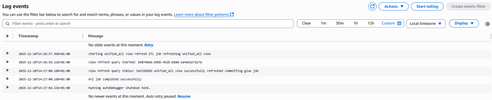 --\> log of successful run  --\> unified_all view has the new data


# WEEK2 UPDATE TAKE VIDEO


